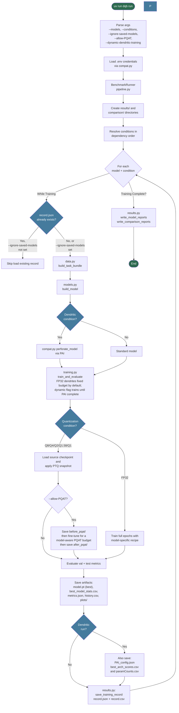
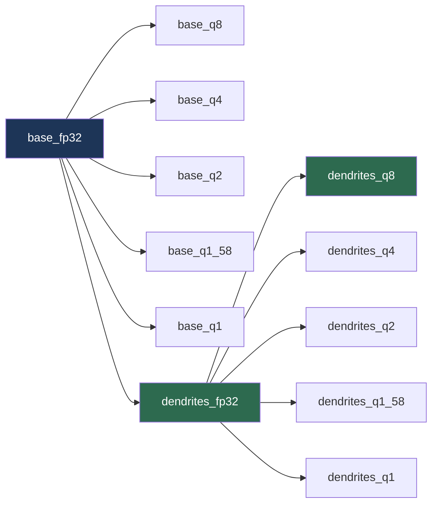
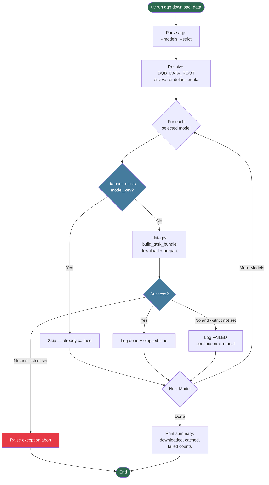
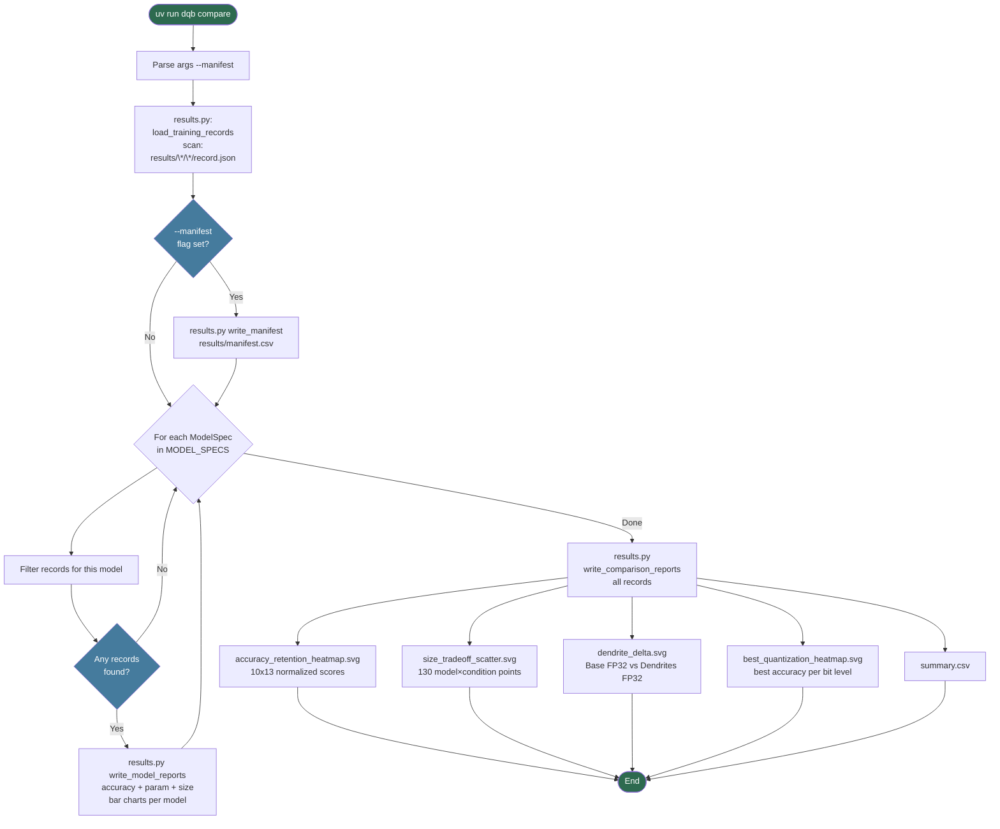
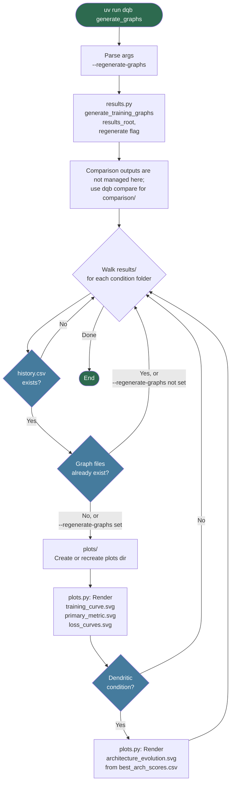
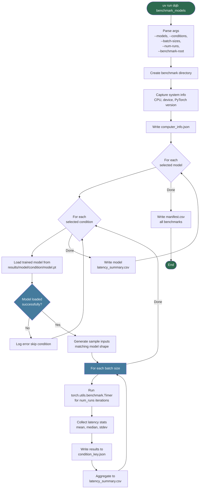
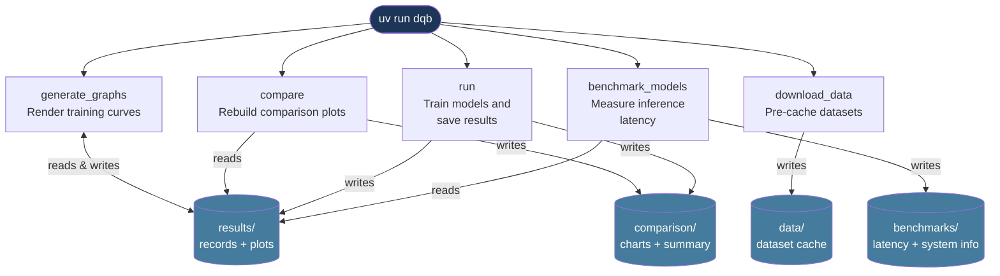

# CLI Command Diagrams

Mermaid flowcharts for all `uv run dqb` commands.

---

## Shared Options

These flags are shared by all commands:

| Flag | Default | Description |
|---|---|---|
| `--results-root DIR` | `results` | Root directory for per-model result folders (also used by `benchmark_models` to locate trained models) |
| `--results-directory NAME` | _unset_ | Optional subdirectory under `--results-root`; when set, results path becomes `<results-root>/<results-directory>` |
| `--logging-dir DIR` | `logs` | Directory for timestamped log files |

`--comparison-root DIR` is available only on `uv run dqb run` and `uv run dqb compare`.

`--benchmark-root DIR` is available only on `uv run dqb benchmark_models`.

---

## `uv run dqb run`

Trains models across all (or a subset of) conditions and saves results.

```bash
uv run dqb run
uv run dqb --results-directory experiment_a run
uv run dqb run --models lenet5 textcnn
uv run dqb run --conditions base_fp32 base_q8 dendrites_fp32
uv run dqb run --results-root results
uv run dqb run --comparison-root comparison
uv run dqb run --allow-PQAT
uv run dqb run --dynamic-dendritic-training
uv run dqb run --ignore-saved-models
```



### Condition Dependency Chain

Conditions must be run in the order below — omitting an upstream condition causes its dependents to be skipped.



---

## `uv run dqb download_data`

Pre-downloads and caches all datasets so that `run` can work offline.

```bash
uv run dqb download_data
uv run dqb download_data --models lenet5 mpnn
uv run dqb download_data --strict
```



---

## `uv run dqb compare`

Rebuilds all comparison outputs from previously saved `record.json` files without retraining.

```bash
uv run dqb compare
uv run dqb --results-directory experiment_a compare
uv run dqb compare --manifest
uv run dqb compare --results-root results --comparison-root comparison
```



---

## `uv run dqb generate_graphs`

Renders per-epoch training-curve plots from saved result histories without retraining.

```bash
uv run dqb generate_graphs
uv run dqb --results-directory experiment_a generate_graphs
uv run dqb generate_graphs --results-root results
uv run dqb generate_graphs --regenerate-graphs
```



---

## `uv run dqb benchmark_models`

Measures wall-clock inference latency for all trained models using `torch.utils.benchmark.Timer`.

```bash
uv run dqb benchmark_models
uv run dqb --results-directory experiment_a benchmark_models
uv run dqb benchmark_models --models lenet5 m5
uv run dqb benchmark_models --conditions base_fp32 base_q4 dendrites_q4
uv run dqb benchmark_models --batch-sizes 1 8 32
uv run dqb benchmark_models --num-runs 20
uv run dqb benchmark_models --benchmark-root my_benchmarks
```



### Output Files

Results are organized by model and condition:

- `benchmarks/computer_info.json` — System specification snapshot
- `benchmarks/manifest.csv` — Cross-model summary of all latency measurements
- `benchmarks/{model}/latency_summary.csv` — Per-model aggregated latencies
- `benchmarks/{model}/{condition}.json` — Full results for one model + condition

---

## Output Directory Layout

```text
.
├── benchmarks/                          # created by dqb benchmark_models
│   ├── computer_info.json
│   ├── manifest.csv
│   └── model_key/
│       ├── latency_summary.csv
│       └── condition_key.json
├── comparison/
│   ├── accuracy_retention_heatmap.svg
│   ├── best_quantization_heatmap.svg
│   ├── dendrite_delta.svg
│   ├── size_tradeoff_scatter.svg
│   └── summary.csv
├── logs/
│   └── command_timestamp.txt
├── PAI/
│   ├── PAI_config.json
│   ├── model_key_condition_key_PAI_config.json
│   └── model_key_condition_key/
└── results/
    └── [results-directory]/                # optional, from --results-directory
        ├── manifest.csv
        └── model_key/
            └── condition_key/
                ├── history.csv
                ├── metrics.json
                ├── model.pt
                ├── PAI_config.json              # dendritic only
                ├── best_model_stats.csv
                ├── record.csv
                ├── record.json
                ├── before_pqat/                 # quantized runs only when --allow-PQAT is enabled
                ├── after_pqat/                  # quantized runs only when --allow-PQAT is enabled
                ├── continued_until_complete/    # dynamic FP32 dendritic epochs beyond max_epochs
                ├── plots/
                │   ├── architecture_evolution.svg  # dendritic only
                │   ├── loss_curves.svg
                │   ├── primary_metric.svg
                │   └── training_curve.svg
                ├── best_arch_scores.csv          # dendritic only
                └── paramCounts.csv               # dendritic only
```

---

## Command Summary


