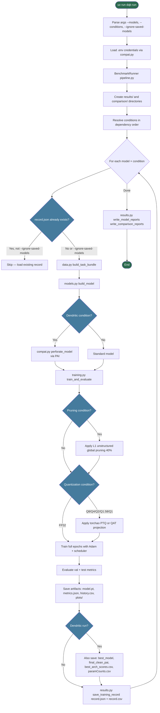
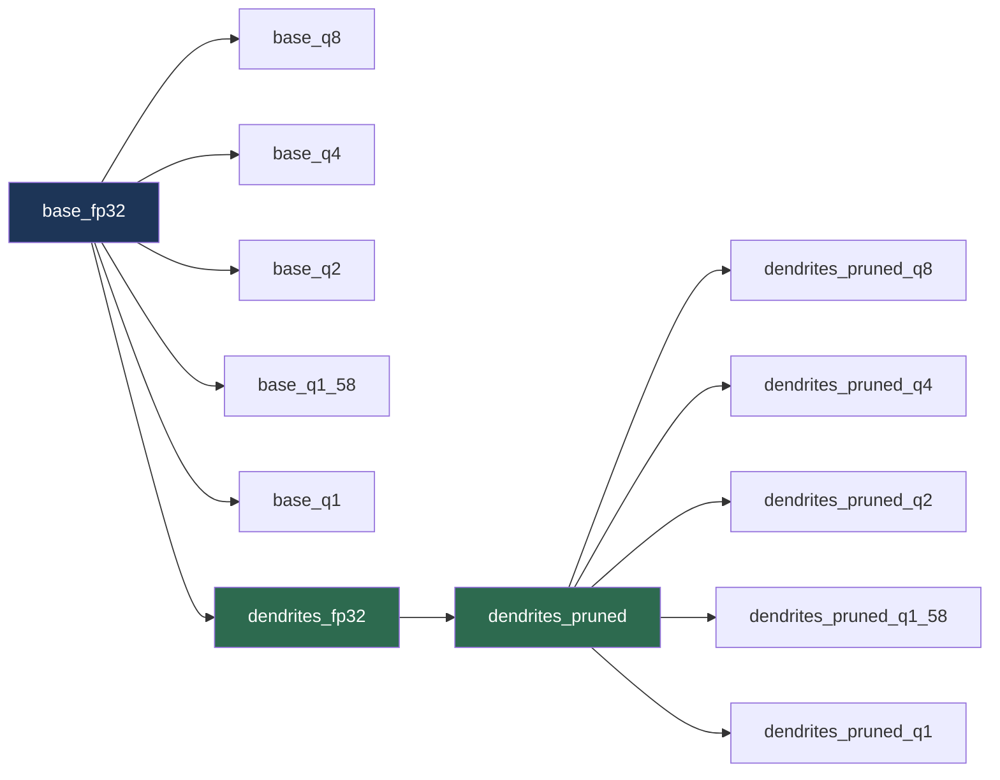
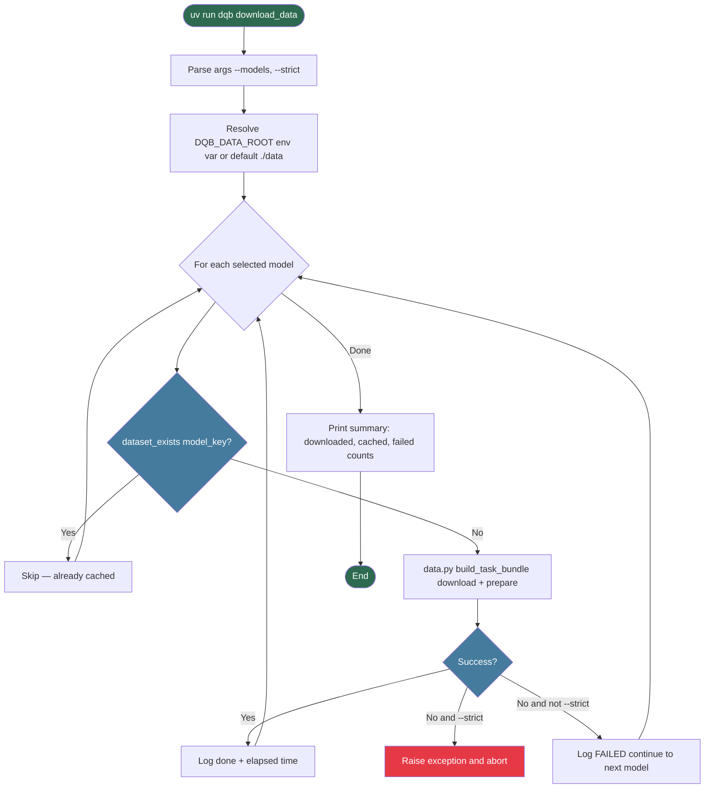
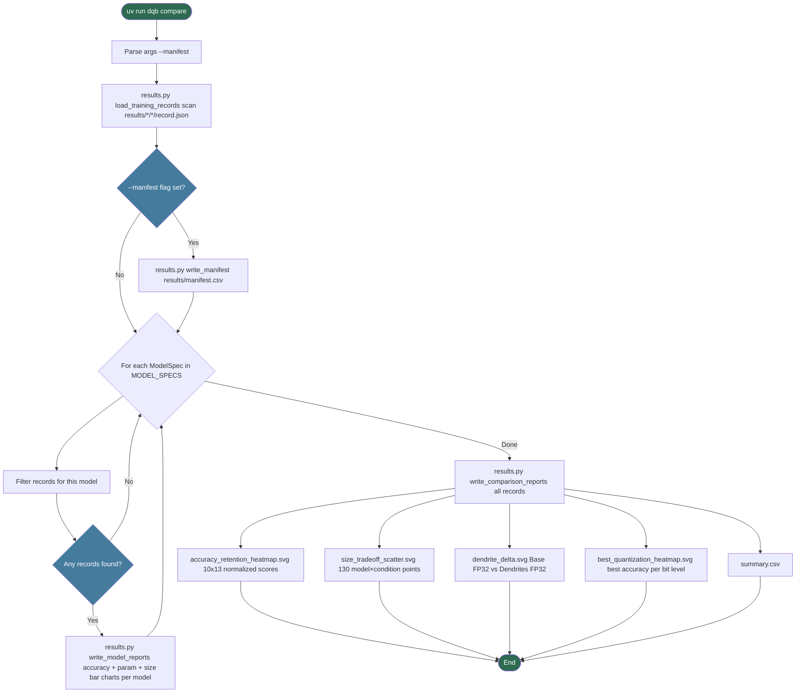
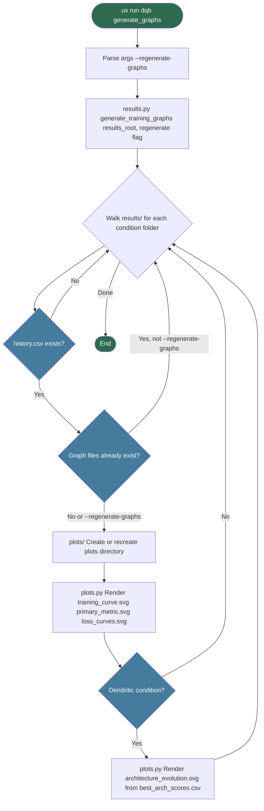
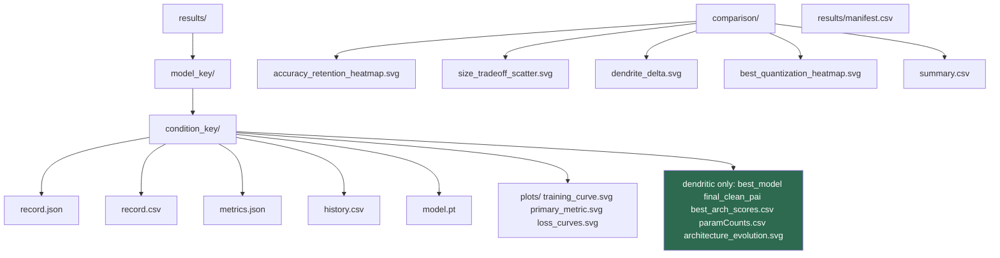
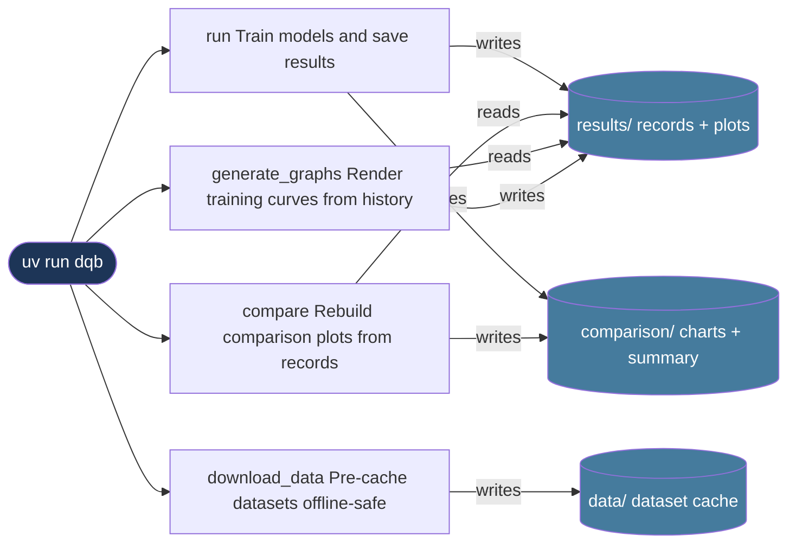

# CLI Command Diagrams

Mermaid flowcharts for all `uv run dqb` commands.

---

## Global Options

All commands share these top-level flags:

| Flag | Default | Description |
|---|---|---|
| `--results-root DIR` | `results` | Root directory for per-model result folders |
| `--comparison-root DIR` | `comparison` | Root directory for cross-model comparison outputs |
| `--logging-dir DIR` | `logs` | Directory for timestamped log files |

---

## `uv run dqb run`

Trains models across all (or a subset of) conditions and saves results.

```bash
uv run dqb run
uv run dqb run --models lenet5 textcnn
uv run dqb run --conditions base_fp32 base_q8 dendrites_fp32
uv run dqb run --results-root results
uv run dqb run --comparison-root comparison
uv run dqb run --ignore-saved-models
```



### Condition Dependency Chain

Conditions must be run in the order below — omitting an upstream condition causes its dependents to be skipped.



---

## `uv run dqb download_data`

Pre-downloads and caches all datasets so that `run` can work offline.

```bash
uv run dqb download_data
uv run dqb download_data --models lenet5 mpnn
uv run dqb download_data --strict
```



---

## `uv run dqb compare`

Rebuilds all comparison outputs from previously saved `record.json` files without retraining.

```bash
uv run dqb compare
uv run dqb compare --manifest
uv run dqb compare --results-root results --comparison-root comparison
```



---

## `uv run dqb generate_graphs`

Renders per-epoch training-curve plots from saved result histories without retraining.

```bash
uv run dqb generate_graphs
uv run dqb generate_graphs --results-root results
uv run dqb generate_graphs --regenerate-graphs
```



---

## Output Directory Layout



---

## Command Summary


