# Model Reference

This file centralizes the current per-model configuration used by the benchmark code.

Sources of truth:
- `src/dendritic_benchmark/specs.py`
- `src/dendritic_benchmark/pipeline.py`
- `src/dendritic_benchmark/models.py`

For each model below, this document captures:
- model key and display name
- domain and dataset
- primary evaluation metric
- model-construction kwargs currently passed by the pipeline
- default training recipe used by `BenchmarkRunner._training_hyperparameters()`
- PerforatedAI module-tracking notes, when applicable
- derived PQAT budget used when `uv run dqb run --allow-PQAT` is enabled

## Shared Notes

- Default training recipe fields:
  - `batch_size`
  - `max_epochs`
  - `learning_rate`
  - `optimizer_name`
  - `momentum`
  - `weight_decay`
- Derived PQAT budget:
  - `ceil(max_epochs * 0.30)`, capped to the range `1..10`
- Model kwargs:
  - Only listed when the pipeline passes non-empty kwargs to `build_model(...)`
- Perforation registration:
  - The benchmark registers tensor-returning `nn.Linear`, `nn.Conv1d`, and `nn.Conv2d` modules for PerforatedAI perforation.
  - Recurrent, graph-attention, capsule, and tabular-attention models expose their gates/projections as explicit Linear/Conv modules, rather than handing tuple-returning `nn.LSTM`, `nn.GRU`, or `nn.MultiheadAttention` modules directly to PerforatedAI.
  - Dendritic conditions fail fast if PerforatedAI is unavailable or cannot perforate the model; the runner does not silently record unperforated fallback models as dendritic results.
- Dendritic epoch policy:
  - By default, dendritic FP32 runs use the listed `max_epochs` value as a hard budget matching Base FP32.
  - PerforatedAI insertion is active for the first 80% of that budget with fixed switch intervals, then frozen for the last 20%.
  - With `uv run dqb run --dynamic-dendritic-training`, training continues past that budget until PerforatedAI reports `training_complete=True`.
  - Dynamic epochs beyond `max_epochs` are saved under `continued_until_complete/`.
- Reproducibility note:
  - Model definitions are part of the experimental condition. After architecture changes, rerun affected keys with `--ignore-saved-models` or use a fresh `--results-directory` to avoid comparing old checkpoints against new implementations.

## 1. `lenet5` — LeNet-5

- Domain: Image Classification
- Dataset: MNIST
- Primary metric: Accuracy
- Metric direction: maximize
- Factory key: `lenet5`
- Model kwargs: `num_classes=10`
- Training recipe:
  - `batch_size=256`
  - `max_epochs=20`
  - `learning_rate=1.0e-2`
  - `optimizer_name=sgd`
  - `momentum=0.9`
  - `weight_decay=0.0`
- Perforation registration: default
- PQAT epoch budget: `2`
- Architecture diagram:

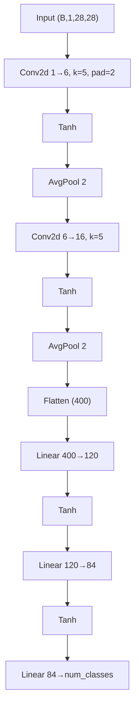

## 2. `m5` — M5 (1D-CNN)

- Domain: Audio Classification
- Dataset: SpeechCommands
- Primary metric: Accuracy
- Metric direction: maximize
- Factory key: `m5`
- Model kwargs: `num_classes=12`
- Training recipe:
  - `batch_size=128`
  - `max_epochs=30`
  - `learning_rate=1.0e-2`
  - `optimizer_name=adam`
  - `momentum=0.9`
  - `weight_decay=1.0e-4`
- Perforation registration: default
- PQAT epoch budget: `3`
- Architecture diagram:

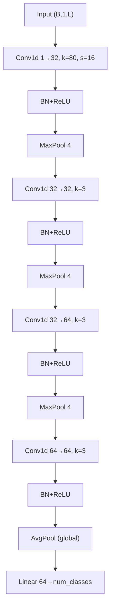

## 3. `lstm_forecaster` — LSTM Univariate

- Domain: Time-Series Forecasting
- Dataset: ETTh1
- Primary metric: MAE
- Metric direction: minimize
- Factory key: `lstm_forecaster`
- Model kwargs: none
- Training recipe:
  - `batch_size=256`
  - `max_epochs=40`
  - `learning_rate=1.0e-3`
  - `optimizer_name=adam`
  - `momentum=0.9`
  - `weight_decay=0.0`
- Architecture: two-layer LSTM forecaster implemented with explicit Linear input/hidden gates so recurrent gates are eligible for dendritic perforation.
- Perforation registration: default
- PQAT epoch budget: `4`
- Architecture diagram:

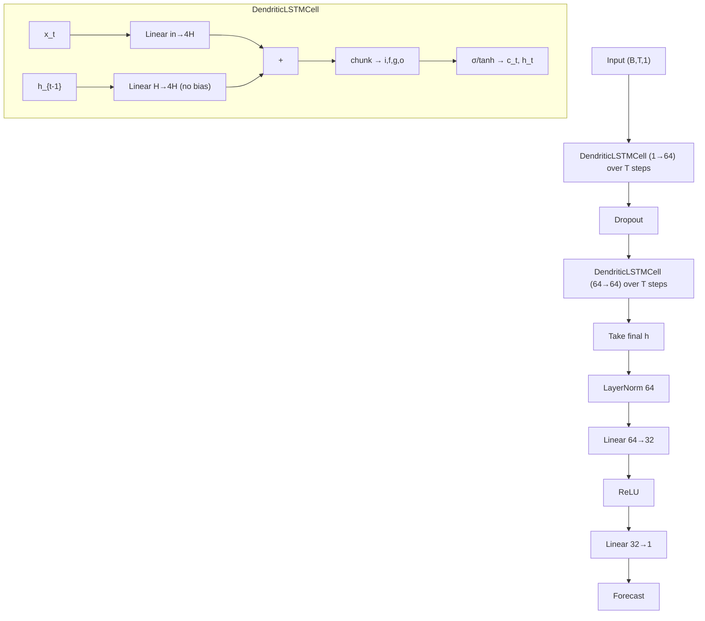

## 4. `textcnn` — TextCNN

- Domain: NLP / Text Classification
- Dataset: AG News
- Primary metric: Accuracy
- Metric direction: maximize
- Factory key: `textcnn`
- Model kwargs: `num_classes=4`
- Training recipe:
  - `batch_size=128`
  - `max_epochs=10`
  - `learning_rate=1.0e-3`
  - `optimizer_name=adam`
  - `momentum=0.9`
  - `weight_decay=1.0e-4`
- Perforation registration: default
- PQAT epoch budget: `1`
- Architecture diagram:

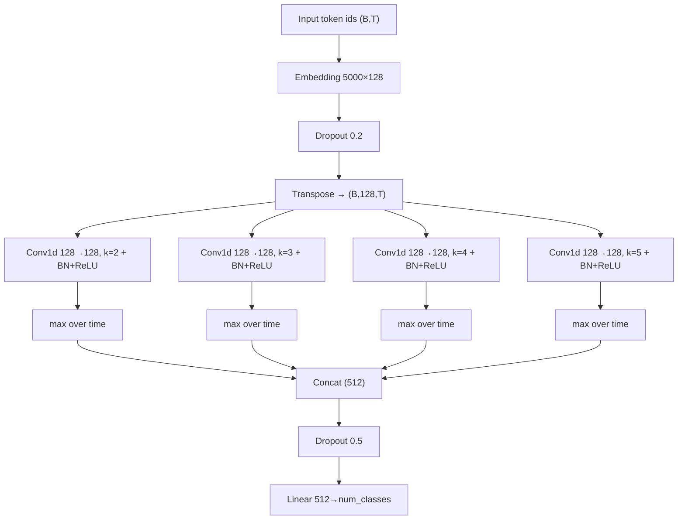

## 5. `gcn` — GCN

- Domain: Graph / Node Classification
- Dataset: Cora
- Primary metric: Accuracy
- Metric direction: maximize
- Factory key: `gcn`
- Model kwargs: `num_classes=7`
- Training recipe:
  - `batch_size=32`
  - `max_epochs=200`
  - `learning_rate=1.0e-2`
  - `optimizer_name=adam`
  - `momentum=0.9`
  - `weight_decay=5.0e-4`
- Perforation registration: default
- Special dendritic note:
  - The pipeline adjusts the GCN `GraphConv` linears to `set_this_output_dimensions([-1, -1, 0])` when available.
- PQAT epoch budget: `10`
- Architecture diagram:

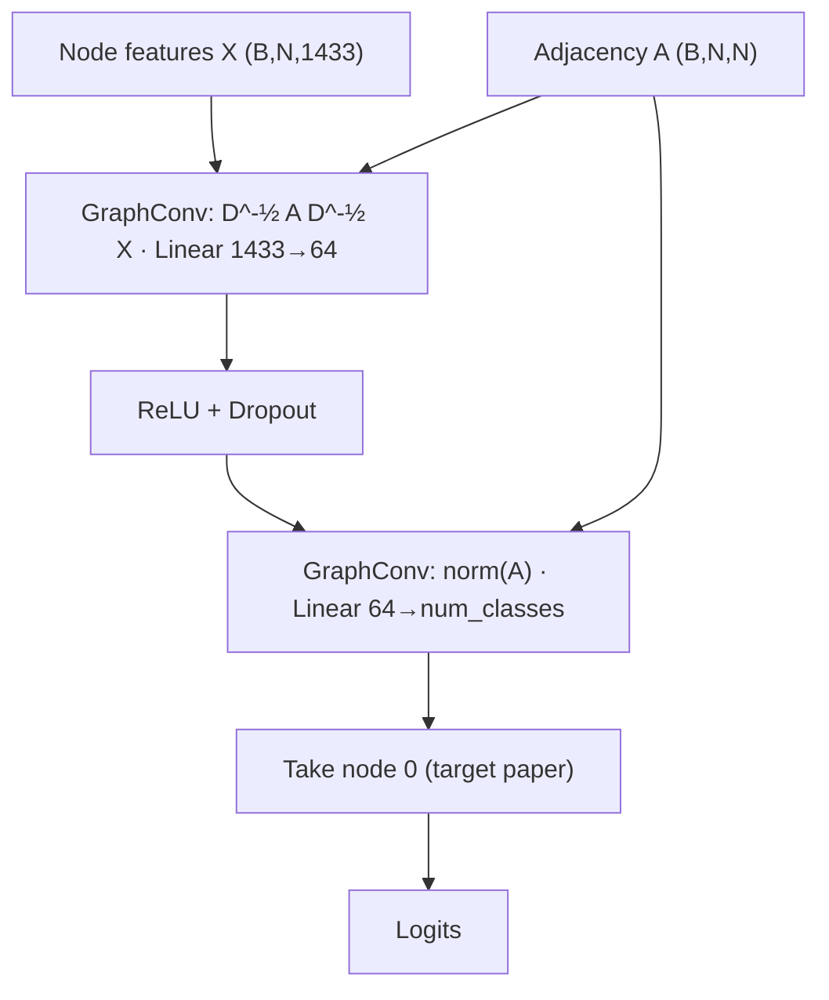

## 6. `tabnet` — TabNet

- Domain: Tabular Classification
- Dataset: Adult Income
- Primary metric: Accuracy
- Metric direction: maximize
- Factory key: `tabnet`
- Model kwargs: `num_classes=2`
- Architecture: TabNet-style sequential attentive tabular classifier with sparsemax feature masks, GLU feature transformers, and four decision steps.
- Architecture diagram:

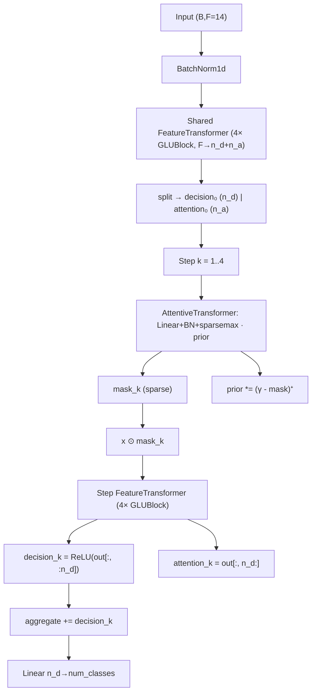
- Training recipe:
  - `batch_size=1024`
  - `max_epochs=100`
  - `learning_rate=2.0e-3`
  - `optimizer_name=adamw`
  - `momentum=0.9`
  - `weight_decay=1.0e-5`
- Perforation registration: default
- PQAT epoch budget: `10`

## 7. `mpnn` — MPNN

- Domain: Drug Discovery / Molecular
- Dataset: ESOL
- Primary metric: RMSE
- Metric direction: minimize
- Factory key: `mpnn`
- Model kwargs: none
- Architecture: multi-step dense molecular MPNN with edge message MLPs, dendritic Linear GRU-style updates, gated graph readout, and scalar regression head.
- Architecture diagram:

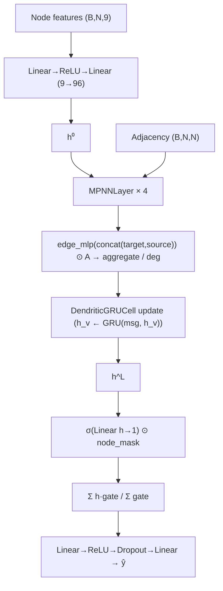
- Training recipe:
  - `batch_size=32`
  - `max_epochs=100`
  - `learning_rate=1.0e-3`
  - `optimizer_name=adam`
  - `momentum=0.9`
  - `weight_decay=1.0e-5`
- Perforation registration: default
- PQAT epoch budget: `10`

## 8. `actor_critic` — Actor-Critic

- Domain: Reinforcement Learning
- Dataset: CartPole-v1
- Primary metric: Reward
- Metric direction: maximize
- Factory key: `actor_critic`
- Model kwargs: none
- Training recipe:
  - `batch_size=512`
  - `max_epochs=40`
  - `learning_rate=3.0e-4`
  - `optimizer_name=adam`
  - `momentum=0.9`
  - `weight_decay=0.0`
- Perforation registration: default
- PQAT epoch budget: `4`
- Architecture diagram:

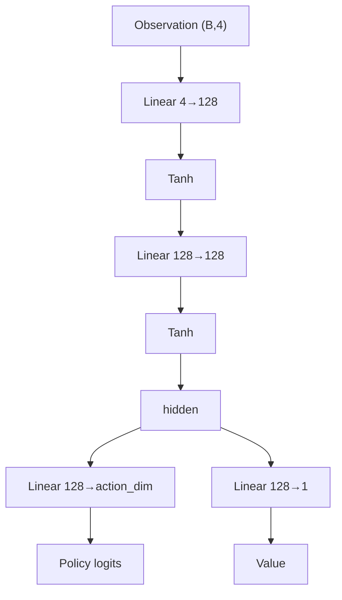

## 9. `lstm_autoencoder` — LSTM Autoencoder

- Domain: Anomaly Detection
- Dataset: MIT-BIH
- Primary metric: AUC
- Metric direction: maximize
- Factory key: `lstm_autoencoder`
- Model kwargs: none
- Training recipe:
  - `batch_size=128`
  - `max_epochs=50`
  - `learning_rate=1.0e-3`
  - `optimizer_name=adam`
  - `momentum=0.9`
  - `weight_decay=0.0`
- Architecture: sequence-to-sequence LSTM autoencoder implemented with explicit Linear gates and a compact latent bottleneck.
- Perforation registration: default
- PQAT epoch budget: `5`
- Architecture diagram:

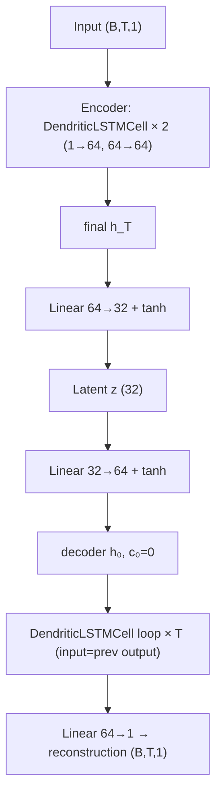

## 10. `distilbert` — DistilBERT

- Domain: NLP / Seq Classification
- Dataset: SST-2
- Primary metric: Accuracy
- Metric direction: maximize
- Factory key: `distilbert`
- Model kwargs: `num_classes=2`
- Architecture: `distilbert-base-uncased` loaded via `transformers.AutoModelForSequenceClassification`. 6-layer Transformer encoder (66M parameters) fine-tuned for binary sentiment classification. Input batches are 3-tuples `(input_ids, attention_mask, label)` produced by the matching HuggingFace tokenizer with `max_length=128`.
- Training recipe:
  - `batch_size=32`
  - `max_epochs=4`
  - `learning_rate=1.0e-4`
  - `optimizer_name=adamw`
  - `momentum=0.9`
  - `weight_decay=1.0e-2`
- Perforation registration: default (`nn.Linear`) — targets the Q/K/V/output projections inside each attention block and the two feed-forward sublayer linears.
- PQAT epoch budget: `1`
- Architecture diagram:

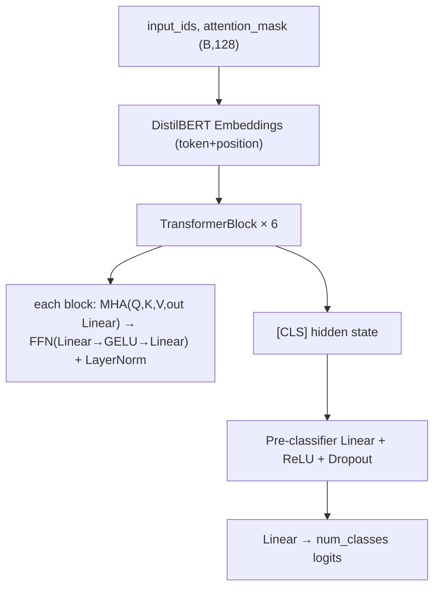

## 11. `dqn_lunarlander` — DQN (LunarLander)

- Domain: Reinforcement Learning
- Dataset: LunarLander-v2
- Primary metric: Reward
- Metric direction: maximize
- Factory key: `dqn_lunarlander`
- Model kwargs: none
- Architecture: 3-layer MLP Q-network with 256-unit hidden layers matching the observation/action dimensions of LunarLander.
- Architecture diagram:

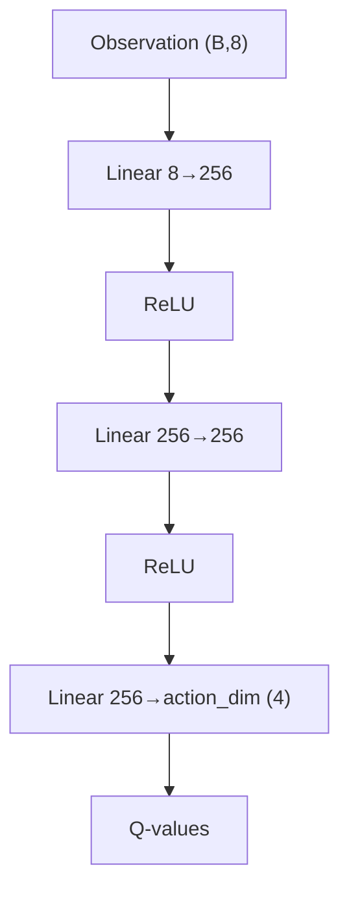
- Training recipe:
  - `batch_size=128`
  - `max_epochs=120`
  - `learning_rate=6.3e-4`
  - `optimizer_name=adam`
  - `momentum=0.9`
  - `weight_decay=0.0`
- Perforation registration: default
- PQAT epoch budget: `10`

## 12. `ppo_bipedalwalker` — PPO Policy Network

- Domain: Reinforcement Learning
- Dataset: BipedalWalker-v3
- Primary metric: Reward
- Metric direction: maximize
- Factory key: `ppo_bipedalwalker`
- Model kwargs: none
- Architecture: PPO-style continuous-action policy MLP with tanh actor mean, learnable log standard deviation, and critic head. Supervised benchmark training uses the actor output against heuristic actions.
- Architecture diagram:

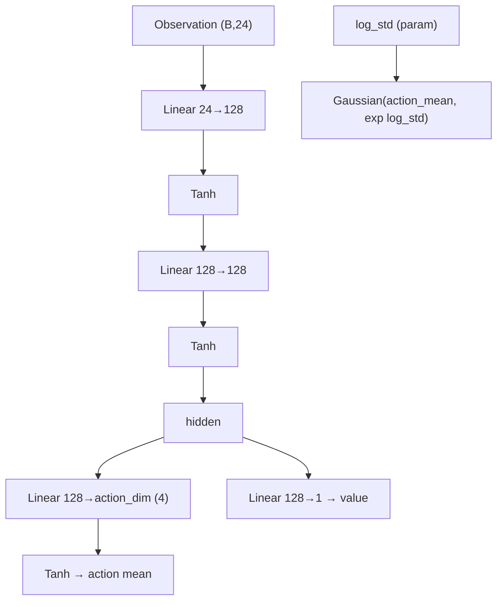
- Training recipe:
  - `batch_size=64`
  - `max_epochs=120`
  - `learning_rate=3.0e-4`
  - `optimizer_name=adam`
  - `momentum=0.9`
  - `weight_decay=0.0`
- Perforation registration: default
- PQAT epoch budget: `10`

## 13. `attentivefp_freesolv` — AttentiveFP

- Domain: Drug Discovery / Molecular
- Dataset: FreeSolv
- Primary metric: RMSE
- Metric direction: minimize
- Factory key: `attentivefp_freesolv`
- Model kwargs: none
- Training recipe:
  - `batch_size=32`
  - `max_epochs=100`
  - `learning_rate=1.0e-3`
  - `optimizer_name=adam`
  - `momentum=0.9`
  - `weight_decay=1.0e-5`
- Architecture: AttentiveFP-style graph attention/message-passing network with attention-weighted neighbor updates, gated graph readout, and scalar regression head. GRU-style updates are implemented from Linear gates.
- Architecture diagram:

```mermaid
flowchart TD
    nf["Node features (B,N,9)"] --> proj["Linear→ReLU→Linear (9→128)"] --> h0["h⁰"]
    h0 --> layers["AttentiveFPLayer × 3"]
    adj["Adjacency"] --> layers
    layers --> attn["softmax(LeakyReLU(Linear[dst,src])) over neighbors"]
    attn --> msg["weights · Linear(h)"] --> upd["DendriticGRUCell update"]
    upd --> hL["h^L"]
    hL --> mean["graph = mean(h)"] --> ro["Readout × 2 steps"]
    ro --> ratt["softmax(Tanh(Linear[h, graph])) → context"] --> rgru["DendriticGRUCell(context, graph)"] --> graph["graph"]
    graph --> head["Linear→ReLU→Dropout→Linear → ŷ"]
```
- Perforation registration: default
- PQAT epoch budget: `10`

## 14. `gin_imdbb` — GIN

- Domain: Graph Classification
- Dataset: IMDB-Binary
- Primary metric: Accuracy
- Metric direction: maximize
- Factory key: `gin_imdbb`
- Model kwargs: `num_classes=2`
- Training recipe:
  - `batch_size=32`
  - `max_epochs=100`
  - `learning_rate=1.0e-2`
  - `optimizer_name=adam`
  - `momentum=0.9`
  - `weight_decay=5.0e-4`
- Perforation registration: default
- PQAT epoch budget: `10`
- Architecture diagram:

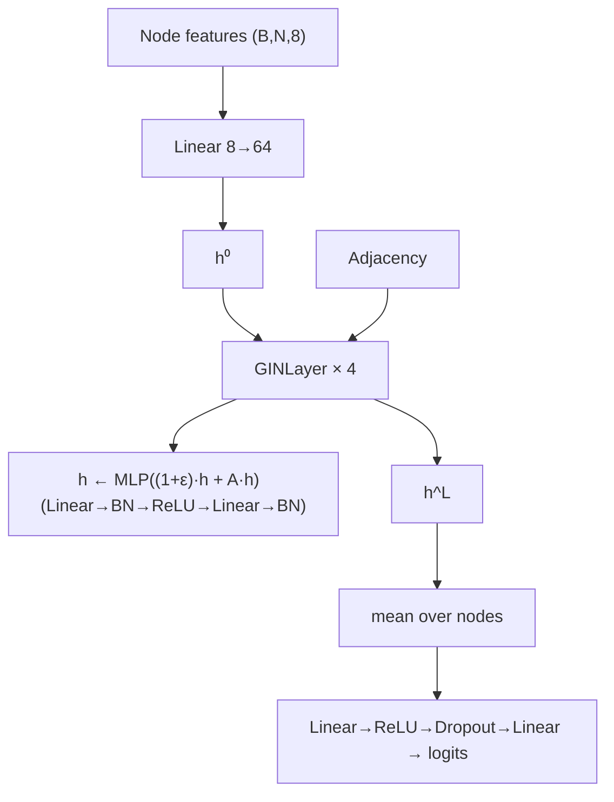

## 15. `tcn_forecaster` — TCN Forecaster

- Domain: Time-Series Forecasting
- Dataset: ETTm1
- Primary metric: MAE
- Metric direction: minimize
- Factory key: `tcn_forecaster`
- Model kwargs: none
- Training recipe:
  - `batch_size=128`
  - `max_epochs=60`
  - `learning_rate=1.0e-3`
  - `optimizer_name=adam`
  - `momentum=0.9`
  - `weight_decay=1.0e-4`
- Perforation registration: default
- PQAT epoch budget: `6`
- Architecture diagram:

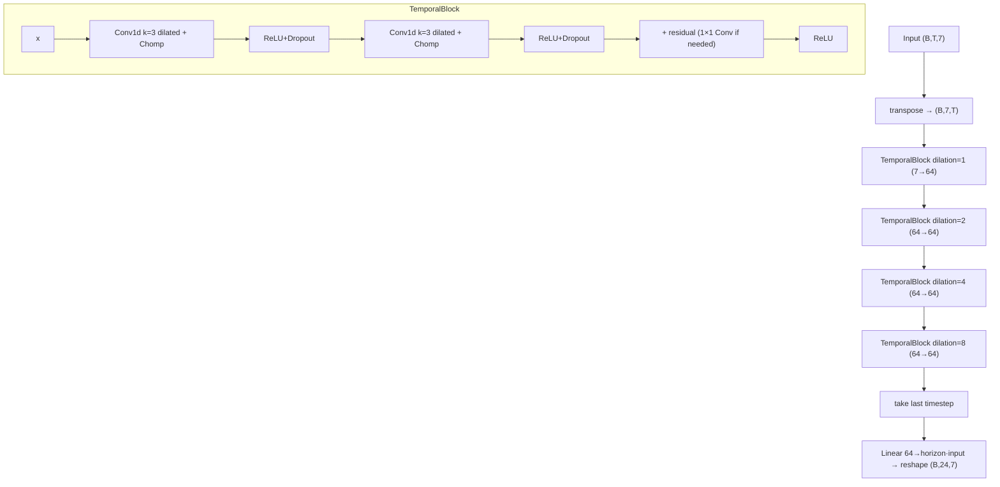

## 16. `gru_forecaster` — GRU Forecaster

- Domain: Time-Series Forecasting
- Dataset: Weather
- Primary metric: MAE
- Metric direction: minimize
- Factory key: `gru_forecaster`
- Model kwargs: none
- Training recipe:
  - `batch_size=24`
  - `max_epochs=50`
  - `learning_rate=1.0e-3`
  - `optimizer_name=adam`
  - `momentum=0.9`
  - `weight_decay=0.0`
- Architecture: two-layer GRU forecaster implemented with explicit Linear update/reset/new gates so recurrent projections can be perforated.
- Perforation registration: default
- PQAT epoch budget: `5`
- Architecture diagram:

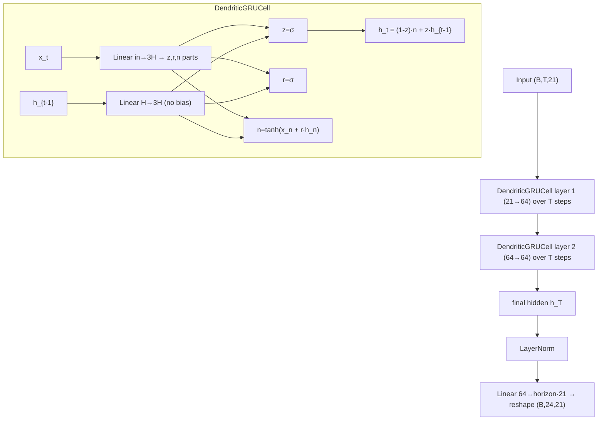

## 17. `pointnet_modelnet40` — PointNet

- Domain: 3D Point Cloud Classification
- Dataset: ModelNet40
- Primary metric: Accuracy
- Metric direction: maximize
- Factory key: `pointnet_modelnet40`
- Model kwargs: `num_classes=40`
- Architecture: PointNet with input transform, feature transform, shared 1x1 convolutions, global max pooling, and MLP classifier.
- Architecture diagram:

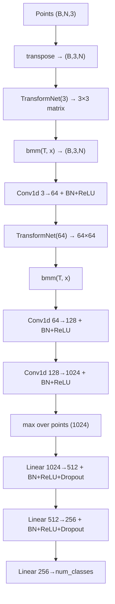
- Training recipe:
  - `batch_size=32`
  - `max_epochs=60`
  - `learning_rate=1.0e-3`
  - `optimizer_name=adam`
  - `momentum=0.9`
  - `weight_decay=1.0e-4`
- Perforation registration: default
- PQAT epoch budget: `6`

## 18. `vae_mnist` — VAE

- Domain: Generative Modeling
- Dataset: MNIST
- Primary metric: ELBO
- Metric direction: maximize
- Factory key: `vae_mnist`
- Model kwargs: none
- Architecture: fully connected MNIST VAE with 32-dimensional latent bottleneck and ELBO training objective.
- Architecture diagram:

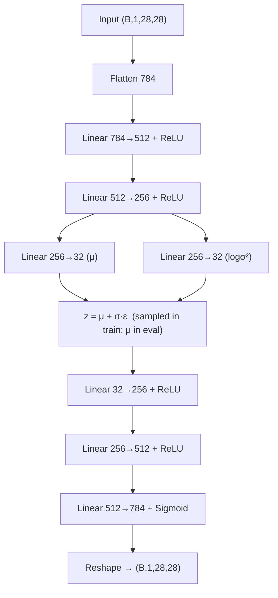
- Training recipe:
  - `batch_size=128`
  - `max_epochs=20`
  - `learning_rate=1.0e-3`
  - `optimizer_name=adam`
  - `momentum=0.9`
  - `weight_decay=0.0`
- Perforation registration: default
- PQAT epoch budget: `2`

## 19. `snn_nmnist` — Spiking Neural Network

- Domain: Neuromorphic Computing
- Dataset: N-MNIST
- Primary metric: Accuracy
- Metric direction: maximize
- Factory key: `snn_nmnist`
- Model kwargs: `num_classes=10`
- Architecture: convolutional leaky-integrate-and-fire spiking network with 10 simulation steps and surrogate-gradient spike activation.
- Architecture diagram:

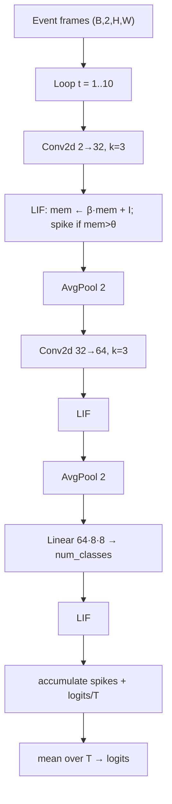
- Training recipe:
  - `batch_size=16`
  - `max_epochs=50`
  - `learning_rate=1.0e-3`
  - `optimizer_name=adam`
  - `momentum=0.9`
  - `weight_decay=0.0`
- Perforation registration: default
- PQAT epoch budget: `5`

## 20. `unet_isic` — Tiny U-Net

- Domain: Medical Image Segmentation
- Dataset: ISIC 2018 Task 1
- Primary metric: Dice
- Metric direction: maximize
- Factory key: `unet_isic`
- Model kwargs: none
- Architecture: encoder-decoder U-Net with three downsampling blocks, bottleneck, transposed-convolution upsampling, skip connections, and binary mask head.
- Architecture diagram:

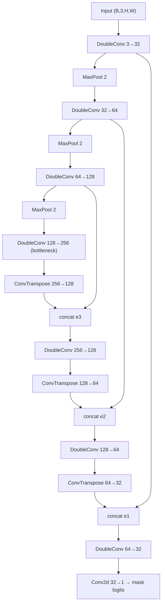
- Training recipe:
  - `batch_size=8`
  - `max_epochs=100`
  - `learning_rate=1.0e-3`
  - `optimizer_name=adam`
  - `momentum=0.9`
  - `weight_decay=1.0e-5`
- Perforation registration: default
- PQAT epoch budget: `10`

## 21. `resnet18_cifar10` — ResNet-18

- Domain: Image Classification
- Dataset: CIFAR-10
- Primary metric: Accuracy
- Metric direction: maximize
- Factory key: `resnet18_cifar10`
- Model kwargs: none
- Training recipe:
  - `batch_size=128`
  - `max_epochs=90`
  - `learning_rate=5.0e-2`
  - `optimizer_name=sgd`
  - `momentum=0.9`
  - `weight_decay=5.0e-4`
- Perforation registration: default
- PQAT epoch budget: `9`
- Architecture diagram:

```mermaid
flowchart TD
    in["Input (B,3,32,32)"] --> stem["Conv2d 3→64, k=3, s=1 (CIFAR stem; maxpool replaced by Identity)"]
    stem --> bn["BN+ReLU"] --> l1["Layer1: BasicBlock × 2 (64)"]
    l1 --> l2["Layer2: BasicBlock × 2 (128, stride 2)"]
    l2 --> l3["Layer3: BasicBlock × 2 (256, stride 2)"]
    l3 --> l4["Layer4: BasicBlock × 2 (512, stride 2)"]
    l4 --> gap["AdaptiveAvgPool"] --> fc["Linear 512→10"]
    note["BasicBlock = Conv→BN→ReLU→Conv→BN + skip"]
```

## 22. `mobilenetv2_cifar10` — MobileNetV2

- Domain: Image Classification
- Dataset: CIFAR-10
- Primary metric: Accuracy
- Metric direction: maximize
- Factory key: `mobilenetv2_cifar10`
- Model kwargs: none
- Training recipe:
  - `batch_size=128`
  - `max_epochs=150`
  - `learning_rate=5.0e-2`
  - `optimizer_name=sgd`
  - `momentum=0.9`
  - `weight_decay=4.0e-5`
- Perforation registration: default
- PQAT epoch budget: `10`
- Architecture diagram:

```mermaid
flowchart TD
    in["Input (B,3,32,32)"] --> stem["Conv2d 3→32, k=3, s=1 (CIFAR stem)"]
    stem --> blocks["InvertedResidual blocks × 17 (expand → depthwise → project, with skip when shapes match)"]
    blocks --> conv["Conv2d → 1280 + BN+ReLU6"]
    conv --> gap["AdaptiveAvgPool"] --> dp["Dropout"] --> fc["Linear 1280→10"]
```

## 23. `saint_adult` — SAINT

- Domain: Tabular Classification
- Dataset: Adult Income
- Primary metric: Accuracy
- Metric direction: maximize
- Factory key: `saint_adult`
- Model kwargs: `num_classes=2`
- Training recipe:
  - `batch_size=256`
  - `max_epochs=100`
  - `learning_rate=1.0e-4`
  - `optimizer_name=adamw`
  - `momentum=0.9`
  - `weight_decay=1.0e-5`
- Architecture: SAINT-style tabular transformer with explicit Linear Q/K/V projections, column attention, row attention across the mini-batch, and pooled classification head.
- Architecture diagram:

```mermaid
flowchart TD
    in["Input (B,F=14)"] --> emb["Linear 1→64 per feature + column embedding → tokens (B,F,64)"]
    emb --> blocks["depth × 2"]
    blocks --> col["Column block: SelfAttention(Q,K,V Linear; out Linear) + LN + FFN(Linear→GELU→Linear) + LN  (over F tokens)"]
    col --> rowt["transpose batch↔feature → row-attention block (across batch) → transpose back"]
    rowt --> mix["tokens = ½ (column_out + row_out)"]
    mix --> mean["mean over feature tokens → (B,64)"]
    mean --> head["LN → Linear 64→64 → ReLU → Linear → num_classes"]
```
- Perforation registration: default
- PQAT epoch budget: `10`

## 24. `capsnet_mnist` — CapsNet

- Domain: Image Classification
- Dataset: MNIST
- Primary metric: Accuracy
- Metric direction: maximize
- Factory key: `capsnet_mnist`
- Model kwargs: `num_classes=10`
- Architecture: Capsule Network with convolutional stem, primary capsules, digit capsules, three routing iterations, and class logits from capsule lengths.
- Architecture diagram:

```mermaid
flowchart TD
    in["Input (B,1,28,28)"] --> conv["Conv2d 1→256, k=9 + ReLU"]
    conv --> prim["PrimaryCapsules: Conv2d → reshape → 1152 capsules of dim 8 + squash"]
    prim --> votes["Votes: einsum(primary, route_weights) → (B, 1152, num_classes, 16)"]
    votes --> route["Routing × 3: softmax(logits) → coeffs → outputs = squash(Σ c·v) → logits += v·outputs"]
    route --> out["Digit caps (B, num_classes, 16)"] --> norm["||·|| over capsule dim → class scores"]
```
- Training recipe:
  - `batch_size=128`
  - `max_epochs=30`
  - `learning_rate=3.0e-3`
  - `optimizer_name=adam`
  - `momentum=0.9`
  - `weight_decay=0.0`
- Perforation registration: default
- PQAT epoch budget: `3`

## 25. `convlstm_movingmnist` — ConvLSTM

- Domain: Spatiotemporal Prediction
- Dataset: Moving MNIST
- Primary metric: SSIM
- Metric direction: maximize
- Factory key: `convlstm_movingmnist`
- Model kwargs: none
- Architecture: two-layer ConvLSTM with 64 hidden channels and convolutional frame decoder for 10-frame Moving MNIST prediction.
- Architecture diagram:

```mermaid
flowchart TD
    in["Input frames (B,T,1,H,W)"] --> loop["Loop step = 0 .. T+horizon-1"]
    loop --> sel["frame = x[:,t] if t<T else previous decoded frame"]
    sel --> c1["ConvLSTMCell 1 (in=1, hidden=64): Conv2d(in+H, 4H, k=3) → i,f,o,g"]
    c1 --> c2["ConvLSTMCell 2 (in=64, hidden=64)"]
    c2 --> dec["Conv2d 64→1 + Sigmoid → next frame"]
    dec --> sel
    dec --> coll["collect outputs for steps ≥ T"] --> stk["stack → (B, horizon, 1, H, W)"]
```
- Training recipe:
  - `batch_size=16`
  - `max_epochs=50`
  - `learning_rate=1.0e-3`
  - `optimizer_name=adam`
  - `momentum=0.9`
  - `weight_decay=0.0`
- Perforation registration: default
- PQAT epoch budget: `5`
