# Model Reference

This file centralizes the current per-model configuration used by the benchmark code.

Sources of truth:
- `src/dendritic_benchmark/specs.py`
- `src/dendritic_benchmark/pipeline.py`
- `src/dendritic_benchmark/models.py`

For each model below, this document captures:
- model key and display name
- domain and dataset
- primary evaluation metric
- model-construction kwargs currently passed by the pipeline
- default training recipe used by `BenchmarkRunner._training_hyperparameters()`
- PerforatedAI module-tracking notes, when applicable
- derived PQAT budget used when `uv run dqb run --allow-PQAT` is enabled

## Shared Notes

- Default training recipe fields:
  - `batch_size`
  - `max_epochs`
  - `learning_rate` — the *base* rate; the schedule below is applied on top of it
  - `optimizer_name` — `adam`, `adamw`, or `sgd`
  - `momentum` — SGD only
  - `weight_decay`
  - `nesterov` — SGD only; ignored when `momentum` is 0
- Learning-rate schedule fields (only the ones a recipe actually uses are listed
  per model). `training._scheduled_learning_rate` recomputes the rate from the
  base value and the epoch index every epoch rather than mutating it in place,
  so it survives both checkpoint resume and PerforatedAI rebuilding the
  optimizer on dendrite restructuring:
  - `lr_schedule` — `constant`, `step`, `cosine`, or `linear`
  - `lr_decay_every`, `lr_decay_gamma` — `step` only: multiply by gamma every N epochs
  - `lr_min_factor` — `cosine`/`linear` floor, as a fraction of the base rate
  - `warmup_epochs` — linear ramp from `base/warmup` up to `base`, applied under
    every schedule. Granularity is one epoch, so it is only used on budgets long
    enough for that to be meaningful.
- Regularisation fields:
  - `label_smoothing` — passed to `CrossEntropyLoss`; classification models only
  - `grad_clip_norm` — global-norm clip applied after `backward()` and before
    `optimizer.step()`, so PerforatedAI's own step sees the clipped gradients
- Why the schedule is not handed to PerforatedAI:
  - The `perforatedai` skill's default advice is to pass the schedule to
    `pai_tracker.setup_optimizer(model, optimArgs, schedArgs)` and let PAI call
    `scheduler.step()`. This benchmark deliberately passes an empty `schedArgs`
    and drives the rate itself. A stateful `torch.optim.lr_scheduler` object is
    rebuilt whenever PAI restructures the model to add dendrites, which resets
    its epoch counter — a cosine curve would restart from the top at every
    dendrite switch, and the baseline and dendritic arms would then see
    different rate trajectories for the same recipe. Recomputing the rate from
    `(base_lr, epoch)` each epoch is stateless, so it is identical in both arms
    and unaffected by restructuring or checkpoint resume. `_setup_pai_optimizer`
    accordingly discards any scheduler PAI hands back.
- Dendritic batch-size scaling:
  - A model listed in `_MODEL_DENDRITIC_BATCH_SIZES` (only DistilBERT today) runs
    its dendritic conditions at a smaller batch so the candidate forward fits in
    memory. `ModelTrainingRecipe.with_batch_size` scales the learning rate by the
    same factor, holding the per-sample step equal to the baseline's.
- Derived PQAT budget:
  - `ceil(max_epochs * 0.30)`, capped to the range `1..10`
- Model kwargs:
  - Only listed when the pipeline passes non-empty kwargs to `build_model(...)`
- Losses:
  - Classification uses `CrossEntropyLoss`; forecasting, molecular regression and
    the reconstruction autoencoder use `MSELoss`; the VAE uses BCE + KL.
  - CapsNet is the exception: its output is a per-class capsule *length* in
    `[0, 1)`, not a logit, so it trains against `CapsuleMarginLoss` (Sabour et
    al., m+ = 0.9, m− = 0.1, λ = 0.5).
- Fixed-width graph batching:
  - Every graph model receives dense `[max_nodes, max_nodes]` adjacency tensors so
    that graphs of different sizes can be batched. Padding slots must be inert:
    they carry zero features and no edges, and each model masks them out of its
    readout. Getting this wrong is silent — the shapes stay valid and the loss
    still falls — so it is worth restating per dataset (`ESOL_MAX_ATOMS`,
    `FREESOLV_MAX_ATOMS`, `IMDB_MAX_NODES`). Cora is the exception and is no
    longer padded at all; see below.
  - Molecular graphs additionally carry a dense `[max_nodes, max_nodes,
    MOLECULE_EDGE_FEATURES]` bond tensor (bond-order one-hot, ring flag,
    self-loop flag). Padding slots and the adjacency's self-loops are distinct
    there: an all-zero edge vector means padding, and the self-loop channel
    marks "this atom, no bond".
  - Cora is **transductive and unbatched**: one forward pass over the whole
    `CORA_NODES = 2708` graph, from which each split selects its own node rows.
    `_CoraTransductiveDataset` has length 1 and yields
    `(x_all, adjacency, node_indices, labels)`; the three splits share one graph
    and differ only in indices; `_BATCH_SIZES["gcn"] = 1`. This is the mechanism
    Kipf & Welling's 81.5% is measured with, and replaced an inductive ego-graph
    setup (`CORA_EGO_NODES = 64`, 2-hop, padded with a virtual node) that scored
    76.4% and was not comparable to it whatever its label budget.
  - Two things about that graph are load-bearing. `GraphConv` computes
    `Â(XW) + b`, **not** `(ÂX)W` — mathematically identical, 0.72 GFLOP against
    10.5, which is the difference between full-graph training being free and
    being the most expensive model in the suite. And moving the bias out of
    `nn.Linear` to get that form means PerforatedAI cannot track the owning
    `GraphConv` (its child `.linear` is perforated), which it reports as
    `Parameter does not have parameter_type attribute in n mode`; the biases are
    registered explicitly through `append_parameter_ids_to_track`, and those ids
    need a leading dot (`".conv1.bias"`) because PAI validates them with the
    same checker it uses for module ids.
  - Which nodes are labelled is the Planetoid split (20 per class / 500 / 1000)
    rather than a 70/15/15 draw.
- Target standardisation:
  - The two molecular regression sets (ESOL, FreeSolv) z-score their targets
    using training-split statistics only. `TaskBundle.target_offset` /
    `target_scale` carry the transform, and `_compute_all_metrics` maps
    predictions back through it, so reported RMSE/MAE stay in log-solubility and
    kcal/mol respectively and remain comparable to MoleculeNet.
- Two of the three "RL" models are behaviour cloning, not reinforcement learning:
  - `actor_critic` and `dqn_lunarlander` train on a fixed cache of observations
    labelled by a heuristic policy. Their training metric is named for what it
    computes — **Action Accuracy**, the fraction of held-out states where the
    network picks the heuristic's discrete action. It is not a return and should
    not be read against published CartPole / LunarLander numbers.
    `ppo_bipedalwalker` is no longer one of these; see the block after this one.
  - **An episodic return is measured** for both, once per run, after the best
    weights are restored, by rolling the policy out in its gym environment for
    20 seeded episodes (`_evaluate_episodic_return` in `training.py`). It is
    recorded in `test_metrics` as `episodic_return_mean` / `_std` / `_min` /
    `_max` and is *never* their selection metric — rollout return is stochastic,
    and promoting it would put a different objective in front of the dendritic
    arm than the loss it actually minimises. This is the number that is
    comparable to published results.
  - Adding that measurement immediately exposed the label sources as broken. The
    hand-written LunarLander heuristic returned **-519** (it crashed on nearly
    every episode) and the BipedalWalker one **-120** (it held both knees at a
    constant 0.45 and never took a step). The clones reproduced them faithfully —
    98.8% action agreement and a 0.0004 action MAE respectively — so the headline
    metrics looked excellent while the policies were worthless. That 0.0004 was
    also flattered by two of the four action dimensions being constant.
  - Both now clone Gymnasium's own reference heuristics
    (`lunar_lander.heuristic`, `BipedalWalkerHeuristics`), and rollout collection
    seeds every episode separately and injects exploration noise while still
    recording the heuristic's correct action, so the cache covers recovery states
    instead of one narrow on-policy chain. Measured effect:

    | model | metric before → after | return before → after | heuristic ceiling | reference |
    |---|---|---|---|---|
    | `actor_critic` | 0.8300 → 0.9273 | 292.7 → **500.0** | 500.0 | 500 = max |
    | `dqn_lunarlander` | 0.9882 → 0.9845 | −522.9 → **+245.3** | 230.5 | 200 = solved |
    | `ppo_bipedalwalker` | −0.0004 → −0.0308 | −119.5 → **−79.6** | 89.2 | 300 = solved |

    (`ppo_bipedalwalker`'s row is history — it has since been converted to real
    PPO and no longer clones anything.)
  - `HEURISTIC_ROLLOUTS_FILENAME` is versioned, so changing a labelling policy
    invalidates the cached rollouts instead of silently reusing old labels.
- `ppo_bipedalwalker` is real, on-policy PPO:
  - It is the only model in the suite whose **training data is a function of its
    own weights**. There is no cached split. One "epoch" is one PPO iteration:
    `PPORolloutSource.collect` runs 2048 steps of the live policy, computes
    GAE(λ) advantages against the critic's own value estimates, and returns a
    fresh `DataLoader` over `(observation, action, old_log_prob, advantage,
    return)`, which `_refresh_on_policy_batches` installs as
    `bundle.train_loader` at the top of the epoch. Ten passes over that buffer
    follow, folded into one loader iteration by `_RepeatedPermutationSampler`.
  - **The metric is the mean episodic return**, and for this model it *is* the
    selection metric — the objective and the reported number are the same thing,
    and a rollout cannot overlap a split, so it is leak-free by construction.
    Validation and test are rollouts rather than loader passes
    (`_rollout_evaluation`), on disjoint seeds, so the return reported for a
    checkpoint is not the return it was selected on. Read it against
    BipedalWalker-v3's 300-point solved threshold; the previous **Neg. Action
    MAE** had no published counterpart at all.
  - Why it replaced behaviour cloning: `BipedalWalkerHeuristics` is a state
    machine carrying the swing leg and gait phase between steps, so one
    observation maps to different actions depending on hidden state a
    feedforward policy cannot observe. The clone was fitting an ill-posed
    function — it reached −80 against the heuristic's +90 and could not have
    closed that gap by training longer.
  - Hyperparameters are Stable-Baselines3 RL Zoo's tuned BipedalWalker-v3 entry
    (n_steps 2048, batch 64, γ 0.999, GAE λ 0.95, 10 passes, clip 0.18,
    ent_coef 0.001, lr 3e-4, max_grad_norm 0.5), with observation normalisation
    and reward scaling by the running std of the discounted return. The
    **budget** is not the Zoo's: 800 iterations (~1.6M steps) against its 5M.
    That is a wall-clock concession, and it is chosen rather than merely
    truncated — an untrained policy stands still for ≈ −9 while one that has
    started moving and still falls scores ≈ −100, so a run that stops inside
    that trough would select its own first epoch as the best checkpoint.
  - Two implementation details that are easy to get wrong and hard to notice:
    observation statistics are folded forward from the *previous* iteration, so
    that within an iteration they are frozen and the importance ratio starts at
    exactly 1; and PerforatedAI's candidate graph is disabled during collection,
    which is 2048 batch-of-one forward passes that no optimizer step ever
    backpropagates through.
  - Dendrites go on the shared `.backbone` only; `.actor_mean` and `.critic` are
    track-only. A dendrite switching in changes its module's output as a step
    change — on the policy head that moves the action distribution outside the
    clip range against the log-probs the live buffer holds, and on the value
    head it changes the baseline those advantages were computed against.
- Perforation registration:
  - The benchmark registers tensor-returning `nn.Linear`, `nn.Conv1d`, and `nn.Conv2d` modules for PerforatedAI perforation.
  - Recurrent, graph-attention, capsule, and tabular-attention models expose their gates/projections as explicit Linear/Conv modules, rather than handing tuple-returning `nn.LSTM`, `nn.GRU`, or `nn.MultiheadAttention` modules directly to PerforatedAI.
  - Dendritic conditions fail fast if PerforatedAI is unavailable or cannot perforate the model; the runner does not silently record unperforated fallback models as dendritic results.
- Dendritic memory cleanup:
  - Long dendritic runs periodically clear PerforatedAI processor buffers and the accelerator cache after completed batches.
  - DistilBERT dendritic runs use a 128-batch cleanup interval to avoid late-epoch MPS memory pressure.
- Dendritic epoch policy:
  - By default, dendritic FP32 runs use the listed `max_epochs` value as a hard budget matching Base FP32.
  - PerforatedAI insertion is active for the first 80% of that budget with fixed switch intervals, then frozen for the last 20%.
  - With `uv run dqb run --dynamic-dendritic-training`, training continues past that budget until PerforatedAI reports `training_complete=True`.
  - Dynamic epochs beyond `max_epochs` are saved under `continued_until_complete/`.
- Comparability to published results:
  - Several baselines were previously measured on a task that was not the one
    the published number describes. Where that was true it has been corrected,
    and the correction is recorded next to the code that implements it:
    - **Forecasting** (`lstm_forecaster`, `tcn_forecaster`, `gru_forecaster`)
      split sliding windows with `random_split` and z-scored using statistics
      over the whole file. Adjacent windows share all but one of their
      timesteps, so a test window's target was routinely inside some training
      window's own lookback. Splits are now chronological with train-only
      normalisation (`_chronological_forecast_bundle`), and the window geometry
      matches the published settings: ETTh1 univariate and ETTm1 multivariate at
      96→24 (Informer), Weather 21-variate at 96→96 (Autoformer). The ETTh1
      window counts reproduce Informer's dataloader exactly (8521/2857/2857).
      `lstm_forecaster` now predicts the whole horizon rather than one step.
    - **`gcn`** trained on a 70/15/15 random split of Cora — 1895 labelled nodes
      against the 140 that Kipf & Welling's 81.5% is measured with — and then,
      after that was corrected, still measured a different *mechanism*:
      inductive classification of 64-node 2-hop ego graphs, 32 per step, where
      Kipf propagate over the whole 2708-node graph in one step. Both are now
      fixed. Cora is transductive and unbatched, and the measured result is
      **0.7990 ± 0.005 over 4 seeds** against the published 81.5% (the ego-graph
      setup scored 76.4%).
    - **`distilbert`** carved its validation set out of GLUE SST-2's *train*
      split, which is phrase-level: Stanford labelled every constituency subtree,
      so a random 10% put phrases in validation whose parent sentences were in
      training. Validation read 95.19% against a test of 90.48%. Training now
      uses the full 67349-row train split, and validation is a stratified 30%
      holdout of the 872-row GLUE dev set (261 val / 611 test). The test number
      was never the wrong one — the reason this mattered is that PerforatedAI's
      switch logic reads *validation*, and a signal inflated by 4.7 points is a
      poor plateau detector.
    - **`pointnet_modelnet40`** was fed the OFF files' vertex lists rather than
      their surfaces: faces were ignored entirely and 1024 evenly spaced vertex
      *indices* were taken, which samples CAD authoring order, not geometry. 24%
      of ModelNet40 meshes have fewer than 1024 vertices and were padded by
      repeating the same corner points. Clouds are now sampled uniformly over
      the mesh faces (area-weighted triangle choice, barycentric point), which
      is what Qi et al.'s released `modelnet40_ply_hdf5_2048` clouds are. The
      training augmentation also rotated about Y; the raw OFF meshes are Z-up,
      so that was tipping objects onto their sides during training while the
      evaluation splits stayed upright.
    - **`mobilenetv2_cifar10`** adapted only the stem stride for 32×32 input,
      leaving 16× downsampling and a 2×2 final feature map. It now matches the
      reference CIFAR stage table (8×, 4×4), worth roughly 2.5 points.
    - **`tabnet`, `saint_adult`** received Adult's eight nominal columns as
      z-scored ordinal codes, asserting an order and a distance between
      categories. Both now embed them (`TabularColumnEmbedding`), as the
      published models do.
    - **`mpnn`, `attentivefp_freesolv`** conditioned messages on the two endpoint
      atoms alone, discarding bond order entirely, and flagged ring membership
      only on the two atoms closing a SMILES ring — 63% of ESOL's ring atoms
      were left unlabelled. Ring perception is now exact (bridge detection) and a
      dense edge-feature tensor reaches the message and attention functions.
  - Numbers that remain **not** comparable, by construction:
    - `actor_critic` and `dqn_lunarlander` report action agreement with a
      scripted policy. Their `episodic_return_*` columns are comparable; their
      headline metric is not.
    - `distilbert`'s test set is 611 rows of the GLUE dev set, not all 872 — the
      other 261 are the validation split. Same protocol, ~1.2× wider confidence
      interval.
    - The three forecasters run on three different datasets, so their MAEs are
      not comparable *to each other* — only to that dataset's published numbers.
    - `lstm_autoencoder` (MIT-BIH AUC) has no single standard protocol to cite.
  - Budgets that are deliberately short of the published recipe, so a shortfall
    is expected rather than a defect: `ppo_bipedalwalker` trains 1.6M
    environment steps against the RL Zoo's 5M, and `pointnet_modelnet40` 200
    epochs against Qi et al.'s 250.
- Reproducibility note:
  - Model definitions are part of the experimental condition. After architecture changes, rerun affected keys with `--ignore-saved-models` or use a fresh `--results-directory` to avoid comparing old checkpoints against new implementations.

## 1. `lenet5` — LeNet-5

- Domain: Image Classification
- Dataset: MNIST
- Primary metric: Accuracy
- Metric direction: maximize
- Factory key: `lenet5`
- Model kwargs: `num_classes=10`
- Training recipe:
  - `batch_size=128`
  - `max_epochs=40`
  - `learning_rate=1.0e-2`
  - `optimizer_name=sgd`
  - `momentum=0.9`
  - `weight_decay=5.0e-4`
  - `lr_schedule=cosine`
  - `nesterov=True`
- Perforation registration: default
- PQAT epoch budget: `10`
- Architecture diagram:

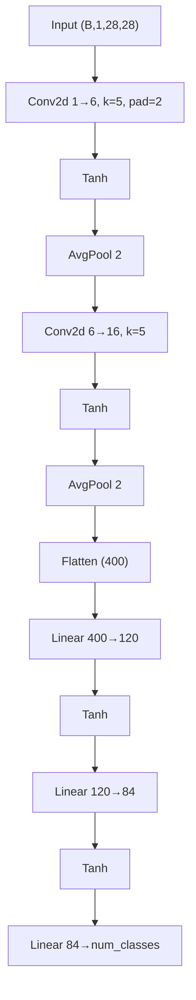
```mermaid
flowchart TD
    in["Input (B,1,28,28)"] --> c1["Conv2d 1→6, k=5, pad=2"] --> t1["Tanh"] --> p1["AvgPool 2"]
    p1 --> c2["Conv2d 6→16, k=5"] --> t2["Tanh"] --> p2["AvgPool 2"]
    p2 --> fl["Flatten (400)"] --> l1["Linear 400→120"] --> t3["Tanh"]
    t3 --> l2["Linear 120→84"] --> t4["Tanh"] --> l3["Linear 84→num_classes"]
```

## 2. `m5` — M5 (1D-CNN)

- Domain: Audio Classification
- Dataset: SpeechCommands
- Primary metric: Accuracy
- Metric direction: maximize
- Factory key: `m5`
- Model kwargs: `num_classes=12`
- Training recipe:
  - `batch_size=128`
  - `max_epochs=40`
  - `learning_rate=1.0e-2`
  - `optimizer_name=adam`
  - `momentum=0.9`
  - `weight_decay=1.0e-4`
  - `lr_schedule=step`
  - `lr_decay_every=20`
  - `lr_decay_gamma=0.1`
- Perforation registration: default
- PQAT epoch budget: `10`
- Architecture diagram:

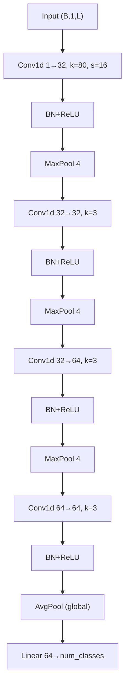
```mermaid
flowchart TD
    in["Input (B,1,L)"] --> c1["Conv1d 1→32, k=80, s=16"] --> b1["BN+ReLU"] --> p1["MaxPool 4"]
    p1 --> c2["Conv1d 32→32, k=3"] --> b2["BN+ReLU"] --> p2["MaxPool 4"]
    p2 --> c3["Conv1d 32→64, k=3"] --> b3["BN+ReLU"] --> p3["MaxPool 4"]
    p3 --> c4["Conv1d 64→64, k=3"] --> b4["BN+ReLU"] --> gp["AvgPool (global)"]
    gp --> fc["Linear 64→num_classes"]
```

## 3. `lstm_forecaster` — LSTM Univariate

- Domain: Time-Series Forecasting
- Dataset: ETTh1
- Primary metric: MAE
- Metric direction: minimize
- Factory key: `lstm_forecaster`
- Model kwargs: none
- Training recipe:
  - `batch_size=256`
  - `max_epochs=60`
  - `learning_rate=1.0e-3`
  - `optimizer_name=adam`
  - `momentum=0.9`
  - `weight_decay=0.0`
  - `lr_schedule=cosine`
  - `lr_min_factor=0.01`
  - `grad_clip_norm=1.0`
- Architecture: two-layer LSTM forecaster implemented with explicit Linear input/hidden gates so recurrent gates are eligible for dendritic perforation.
- Perforation registration: default
- PQAT epoch budget: `10`
- Architecture diagram:

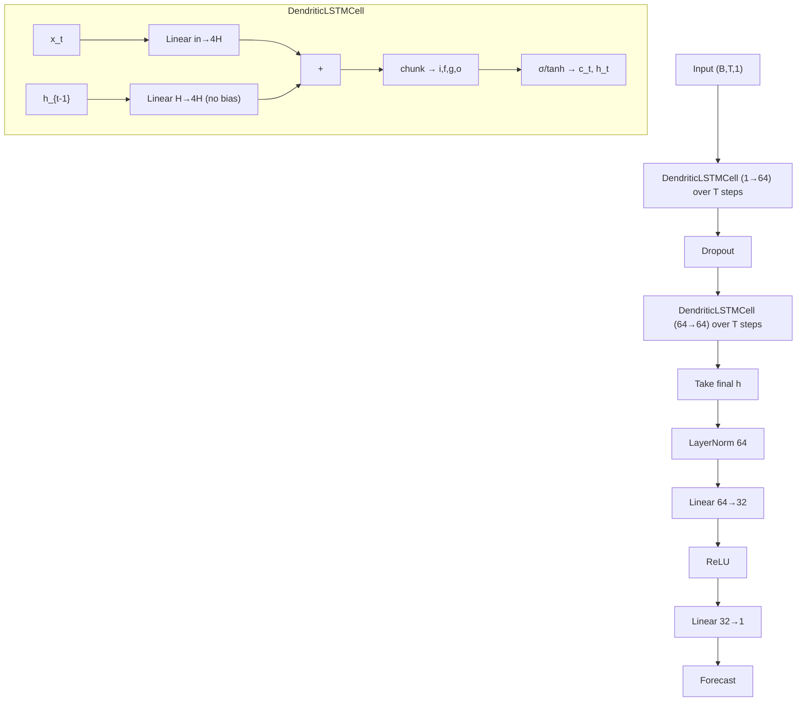
```mermaid
flowchart TD
    in["Input (B,T,1)"] --> cell1["DendriticLSTMCell (1→64) over T steps"]
    cell1 --> dp["Dropout"] --> cell2["DendriticLSTMCell (64→64) over T steps"]
    cell2 --> last["Take final h"] --> ln["LayerNorm 64"]
    ln --> l1["Linear 64→32"] --> r1["ReLU"] --> l2["Linear 32→1"] --> out["Forecast"]
    subgraph Cell ["DendriticLSTMCell"]
        x["x_t"] --> ig["Linear in→4H"]
        h["h_{t-1}"] --> hg["Linear H→4H (no bias)"]
        ig --> sum["+"] --> chunk["chunk → i,f,g,o"]
        hg --> sum
        chunk --> gates["σ/tanh → c_t, h_t"]
    end
```

## 4. `textcnn` — TextCNN

- Domain: NLP / Text Classification
- Dataset: AG News
- Primary metric: Accuracy
- Metric direction: maximize
- Factory key: `textcnn`
- Model kwargs: `num_classes=4`
- Training recipe:
  - `batch_size=128`
  - `max_epochs=30`
  - `learning_rate=1.0e-3`
  - `optimizer_name=adam`
  - `momentum=0.9`
  - `weight_decay=1.0e-4`
  - `lr_schedule=cosine`
  - `lr_min_factor=0.02`
- Perforation registration: default
- PQAT epoch budget: `9`
- Architecture diagram:

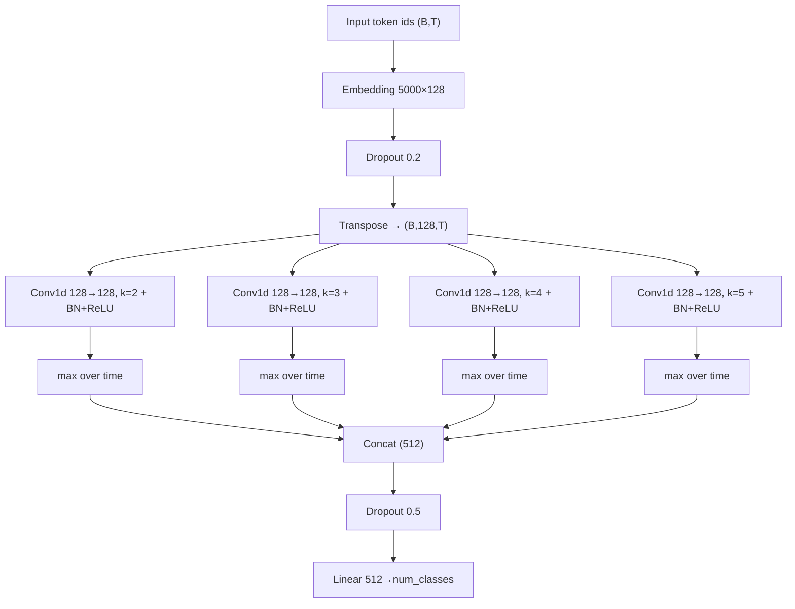
```mermaid
flowchart TD
    in["Input token ids (B,T)"] --> emb["Embedding 5000×128"] --> dp["Dropout 0.2"] --> tr["Transpose → (B,128,T)"]
    tr --> c2["Conv1d 128→128, k=2 + BN+ReLU"] --> p2["max over time"]
    tr --> c3["Conv1d 128→128, k=3 + BN+ReLU"] --> p3["max over time"]
    tr --> c4["Conv1d 128→128, k=4 + BN+ReLU"] --> p4["max over time"]
    tr --> c5["Conv1d 128→128, k=5 + BN+ReLU"] --> p5["max over time"]
    p2 --> cat["Concat (512)"]
    p3 --> cat
    p4 --> cat
    p5 --> cat
    cat --> dp2["Dropout 0.5"] --> head["Linear 512→num_classes"]
```

## 5. `gcn` — GCN

- Domain: Graph / Node Classification
- Dataset: Cora
- Primary metric: Accuracy
- Metric direction: maximize
- Factory key: `gcn`
- Model kwargs: `num_classes=7`
- Training recipe:
  - `batch_size=1` (one full graph; there is nothing to batch)
  - `max_epochs=200`
  - `learning_rate=1.0e-2`
  - `optimizer_name=adam`
  - `momentum=0.9`
  - `weight_decay=5.0e-4`
  - `lr_schedule=cosine`
  - `lr_min_factor=0.05`
- Perforation registration: default, plus `.conv1.bias` / `.conv2.bias` via
  `append_parameter_ids_to_track` — the biases live on `GraphConv` rather than
  inside its `nn.Linear`, and PAI cannot track a module whose child is
  perforated.
- Special dendritic note:
  - The pipeline adjusts the GCN `GraphConv` linears to `set_this_output_dimensions([-1, -1, 0])` when available.
- PQAT epoch budget: `10`
- Measured: test 0.7990 ± 0.005 over 4 seeds; 200 epochs in 3.3 s. Read against
  Kipf & Welling's 81.5%.
- Architecture diagram:

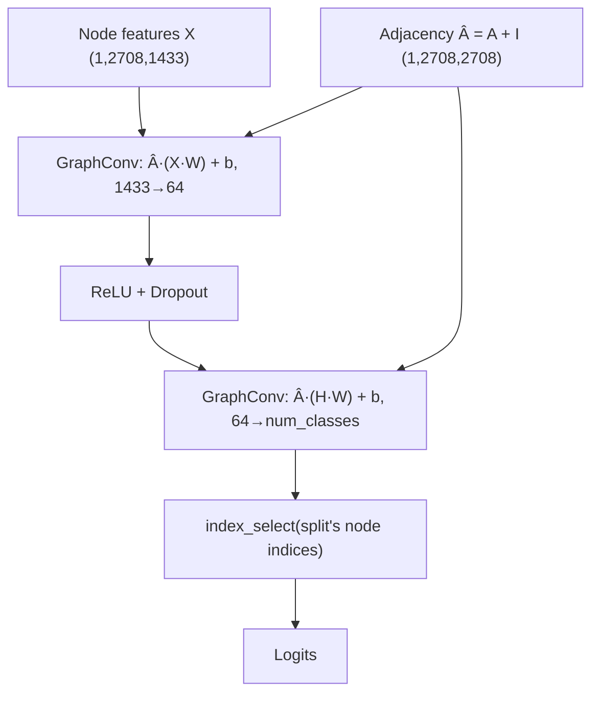
```mermaid
flowchart TD
    feats["Node features X (1,2708,1433)"] --> gc1["GraphConv: ·(X·W) + b, 1433→64"]
    adj["Adjacency  = A + I (1,2708,2708)"] --> gc1
    gc1 --> r["ReLU + Dropout"] --> gc2["GraphConv: ·(H·W) + b, 64→num_classes"]
    adj --> gc2
    gc2 --> sel["index_select(split's node indices)"] --> out["Logits"]
```

## 6. `tabnet` — TabNet

- Domain: Tabular Classification
- Dataset: Adult Income
- Primary metric: Accuracy
- Metric direction: maximize
- Factory key: `tabnet`
- Model kwargs: `num_classes=2`
- Architecture: TabNet-style sequential attentive tabular classifier with sparsemax feature masks, GLU feature transformers, and four decision steps.
- Architecture diagram:

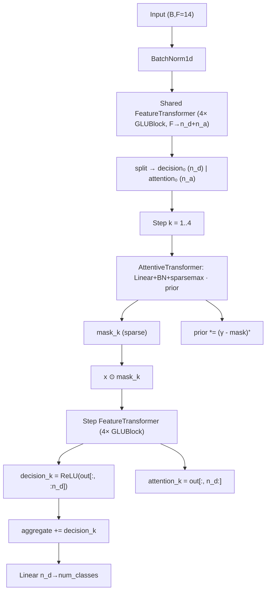
```mermaid
flowchart TD
    in["Input (B,F=14)"] --> bn["BatchNorm1d"] --> shared["Shared FeatureTransformer (4× GLUBlock, F→n_d+n_a)"]
    shared --> split0["split → decision₀ (n_d) | attention₀ (n_a)"]
    split0 --> step["Step k = 1..4"]
    step --> at["AttentiveTransformer: Linear+BN+sparsemax · prior"]
    at --> mask["mask_k (sparse)"] --> mul["x ⊙ mask_k"]
    mul --> ft["Step FeatureTransformer (4× GLUBlock)"]
    ft --> dec["decision_k = ReLU(out[:, :n_d])"]
    ft --> att["attention_k = out[:, n_d:]"]
    dec --> agg["aggregate += decision_k"]
    at --> prior["prior *= (γ - mask)⁺"]
    agg --> head["Linear n_d→num_classes"]
```
- Training recipe:
  - `batch_size=1024`
  - `max_epochs=200`
  - `learning_rate=2.0e-3`
  - `optimizer_name=adamw`
  - `momentum=0.9`
  - `weight_decay=1.0e-5`
  - `lr_schedule=cosine`
  - `lr_min_factor=0.02`
- Perforation registration: default
- PQAT epoch budget: `10`

## 7. `mpnn` — MPNN

- Domain: Drug Discovery / Molecular
- Dataset: ESOL
- Primary metric: RMSE
- Metric direction: minimize
- Factory key: `mpnn`
- Model kwargs: none
- Architecture: multi-step dense molecular MPNN with edge message MLPs, dendritic Linear GRU-style updates, gated graph readout, and scalar regression head.
- Architecture diagram:

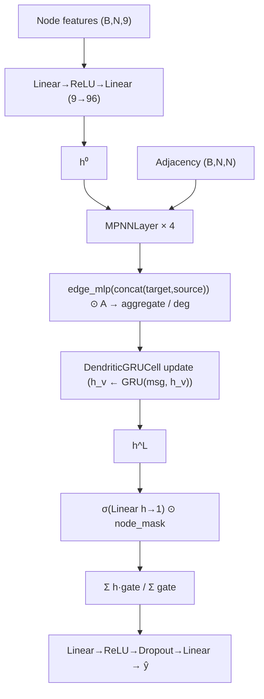
```mermaid
flowchart TD
    nf["Node features (B,N,9)"] --> enc["Linear→ReLU→Linear (9→96)"] --> h0["h⁰"]
    h0 --> step["MPNNLayer × 4"]
    adj["Adjacency (B,N,N)"] --> step
    step --> mlp["edge_mlp(concat(target,source)) ⊙ A → aggregate / deg"]
    mlp --> upd["DendriticGRUCell update (h_v ← GRU(msg, h_v))"]
    upd --> hL["h^L"]
    hL --> gate["σ(Linear h→1) ⊙ node_mask"] --> pool["Σ h·gate / Σ gate"]
    pool --> head["Linear→ReLU→Dropout→Linear → ŷ"]
```
- Training recipe:
  - `batch_size=32`
  - `max_epochs=200`
  - `learning_rate=1.0e-3`
  - `optimizer_name=adam`
  - `momentum=0.9`
  - `weight_decay=1.0e-5`
  - `lr_schedule=cosine`
  - `lr_min_factor=0.02`
  - `grad_clip_norm=5.0`
- Perforation registration: default
- PQAT epoch budget: `10`

## 8. `actor_critic` — Actor-Critic

- Domain: Reinforcement Learning
- Dataset: CartPole-v1
- Primary metric: Action Accuracy
- Metric direction: maximize
- Factory key: `actor_critic`
- Model kwargs: none
- Training recipe:
  - `batch_size=512`
  - `max_epochs=60`
  - `learning_rate=3.0e-4`
  - `optimizer_name=adam`
  - `momentum=0.9`
  - `weight_decay=0.0`
  - `lr_schedule=cosine`
  - `lr_min_factor=0.05`
- Perforation registration: default (`nn.Linear`, `nn.Conv1d`, `nn.Conv2d`). The `.value` head is registered as track-only (PAI wraps it for observation but does not insert dendrites into it); dendrite insertion applies to the shared backbone and policy head only.
- PQAT epoch budget: `10`
- Architecture diagram:

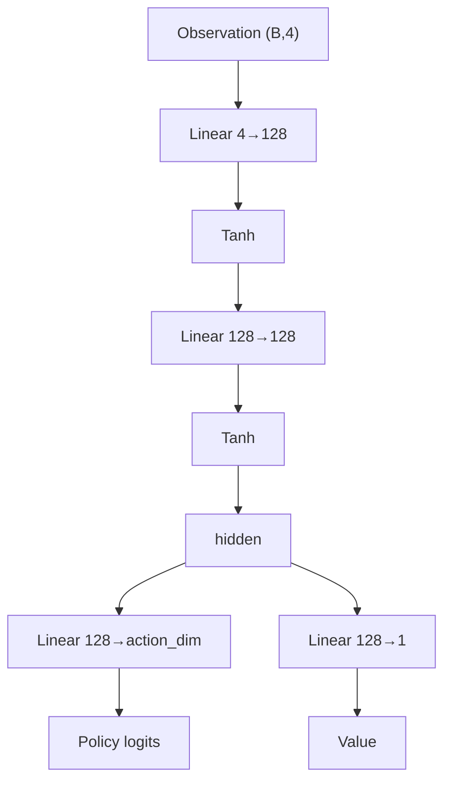
```mermaid
flowchart TD
    obs["Observation (B,4)"] --> b1["Linear 4→128"] --> t1["Tanh"]
    t1 --> b2["Linear 128→128"] --> t2["Tanh"] --> hidden["hidden"]
    hidden --> pol["Linear 128→action_dim"] --> logits["Policy logits"]
    hidden --> val["Linear 128→1"] --> v["Value"]
```

## 9. `lstm_autoencoder` — LSTM Autoencoder

- Domain: Anomaly Detection
- Dataset: MIT-BIH
- Primary metric: AUC
- Metric direction: maximize
- Factory key: `lstm_autoencoder`
- Model kwargs: none
- Training recipe:
  - `batch_size=128`
  - `max_epochs=60`
  - `learning_rate=1.0e-3`
  - `optimizer_name=adam`
  - `momentum=0.9`
  - `weight_decay=0.0`
  - `lr_schedule=cosine`
  - `lr_min_factor=0.02`
  - `grad_clip_norm=1.0`
- Architecture: sequence-to-sequence LSTM autoencoder implemented with explicit Linear gates and a compact latent bottleneck.
- Perforation registration: default
- PQAT epoch budget: `10`
- Architecture diagram:

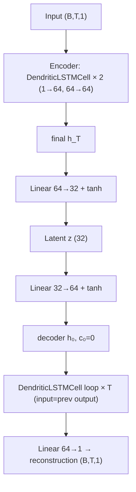
```mermaid
flowchart TD
    in["Input (B,T,1)"] --> enc["Encoder: DendriticLSTMCell × 2 (1→64, 64→64)"]
    enc --> last["final h_T"] --> tl["Linear 64→32 + tanh"] --> z["Latent z (32)"]
    z --> fl["Linear 32→64 + tanh"] --> h0["decoder h₀, c₀=0"]
    h0 --> dec["DendriticLSTMCell loop × T (input=prev output)"]
    dec --> out["Linear 64→1 → reconstruction (B,T,1)"]
```

## 10. `distilbert` — DistilBERT

- Domain: NLP / Seq Classification
- Dataset: SST-2
- Primary metric: Accuracy
- Metric direction: maximize
- Factory key: `distilbert`
- Model kwargs: `num_classes=2`
- Architecture: `distilbert-base-uncased` loaded via `transformers.AutoModelForSequenceClassification`. 6-layer Transformer encoder (66M parameters) fine-tuned for binary sentiment classification. Input batches are 3-tuples `(input_ids, attention_mask, label)` produced by the matching HuggingFace tokenizer with `max_length=128`.
- Splits: train is the full 67349-row GLUE `train` split. Validation and test are
  a stratified 30/70 split of the 872-row GLUE `dev` set — 261 val / 611 test
  (`SST2_DEV_VALIDATION_RATIO`, `_stratified_holdout`). Validation is **not**
  carved out of train, because train is phrase-level: Stanford labelled every
  constituency subtree, so a row-wise split puts a phrase in validation whose
  parent sentence is in training. That read 95.19% val against 90.48% test.
- Training recipe:
  - `batch_size=32`
  - `max_epochs=3`
  - `learning_rate=2.0e-5`
  - `optimizer_name=adamw`
  - `momentum=0.9`
  - `weight_decay=1.0e-2`
  - `lr_schedule=linear`
  - `grad_clip_norm=1.0`
- Perforation registration: head-only (`.model.pre_classifier`, `.model.classifier`) to keep DistilBERT dendritic runs within Apple Silicon MPS memory. The base transformer is excluded from PerforatedAI saving through `.model.base_model`.
- Dendritic runtime note: dendritic DistilBERT uses `batch_size=4`, caps initial PAI correlation to 4 batches, and clears memory every 128 completed batches.
- PQAT epoch budget: `1`
- Architecture diagram:

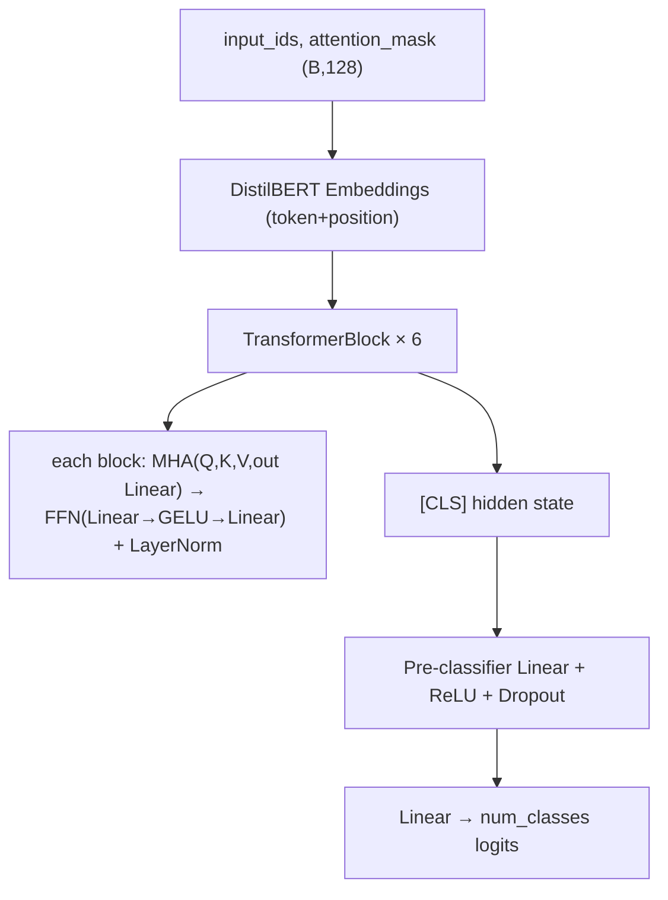
```mermaid
flowchart TD
    tok["input_ids, attention_mask (B,128)"] --> emb["DistilBERT Embeddings (token+position)"]
    emb --> enc["TransformerBlock × 6"]
    enc --> sub["each block: MHA(Q,K,V,out Linear) → FFN(Linear→GELU→Linear) + LayerNorm"]
    enc --> cls["[CLS] hidden state"] --> pool["Pre-classifier Linear + ReLU + Dropout"]
    pool --> head["Linear → num_classes logits"]
```

## 11. `dqn_lunarlander` — DQN (LunarLander)

- Domain: Reinforcement Learning
- Dataset: LunarLander-v2
- Primary metric: Action Accuracy
- Metric direction: maximize
- Factory key: `dqn_lunarlander`
- Model kwargs: none
- Architecture: 3-layer MLP Q-network with 256-unit hidden layers matching the observation/action dimensions of LunarLander.
- Architecture diagram:

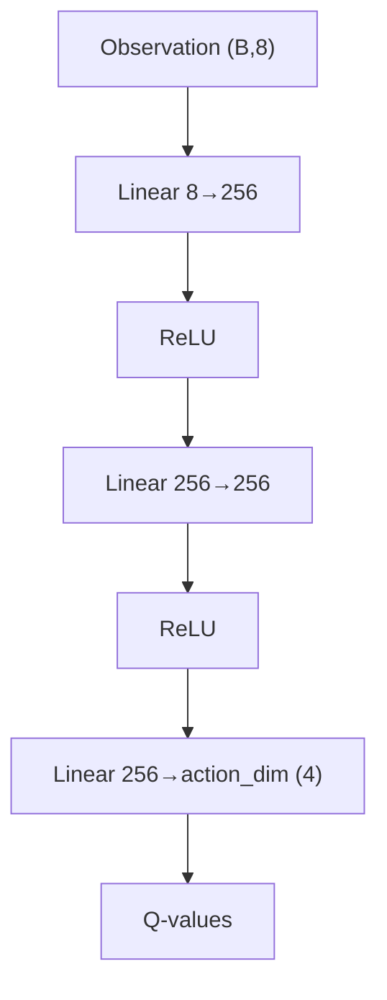
```mermaid
flowchart TD
    obs["Observation (B,8)"] --> l1["Linear 8→256"] --> r1["ReLU"]
    r1 --> l2["Linear 256→256"] --> r2["ReLU"]
    r2 --> l3["Linear 256→action_dim (4)"] --> q["Q-values"]
```
- Training recipe:
  - `batch_size=128`
  - `max_epochs=120`
  - `learning_rate=6.3e-4`
  - `optimizer_name=adam`
  - `momentum=0.9`
  - `weight_decay=0.0`
  - `lr_schedule=cosine`
  - `lr_min_factor=0.05`
- Perforation registration: default
- PQAT epoch budget: `10`

## 12. `ppo_bipedalwalker` — PPO Policy Network

- Domain: Reinforcement Learning (the only on-policy model in the suite)
- Dataset: none — training data is generated by the current policy
- Primary metric: Episodic Return
- Metric direction: maximize
- Factory key: `ppo_bipedalwalker`
- Model kwargs: none
- Architecture: actor-critic MLP with a diagonal Gaussian policy. `forward`
  returns `(mean, log_std, value)`; all three are trained. No tanh on the mean —
  actions are sampled from `N(mean, exp log_std)` and clipped only when the
  environment is stepped, with the log-probability taken on the *unclipped*
  sample (Stable-Baselines3's `squash_output=False`). `log_std` is a single
  state-independent learnable vector. Observations pass through a
  `RunningObsNorm` whose statistics are frozen within an iteration. Orthogonal
  init: √2 through the backbone, 0.01 on the policy mean, 1.0 on the value head.
- Architecture diagram:

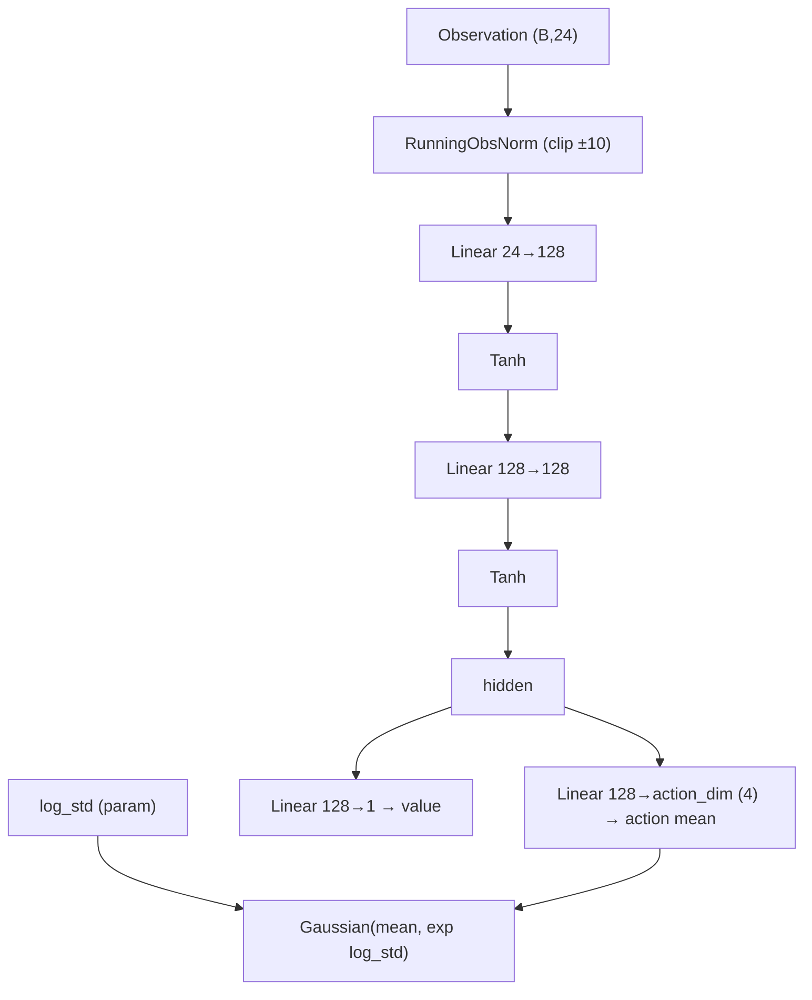
```mermaid
flowchart TD
    obs["Observation (B,24)"] --> n["RunningObsNorm (clip ±10)"]
    n --> b1["Linear 24→128"] --> t1["Tanh"]
    t1 --> b2["Linear 128→128"] --> t2["Tanh"] --> h["hidden"]
    h --> mean["Linear 128→action_dim (4) → action mean"]
    h --> v["Linear 128→1 → value"]
    logstd["log_std (param)"] --> dist["Gaussian(mean, exp log_std)"]
    mean --> dist
```
- Training loop: one epoch = one PPO iteration. 2048 environment steps collected
  by `PPORolloutSource` (persistent env across iterations, GAE(λ), reward scaled
  by the running std of the discounted return), then 10 shuffled passes over
  that buffer at minibatch 64, folded into a single loader iteration by
  `_RepeatedPermutationSampler`. Loss is the clipped surrogate + 0.5·value loss −
  0.001·entropy.
- Training recipe:
  - `batch_size=64` (PPO minibatch)
  - `max_epochs=800` (PPO iterations; ~1.6M environment steps)
  - `learning_rate=3.0e-4`
  - `optimizer_name=adam`
  - `momentum=0.9`
  - `weight_decay=0.0`
  - `lr_schedule=cosine`
  - `lr_min_factor=0.05`
  - `grad_clip_norm=0.5`
  - rollout constants: γ 0.999, GAE λ 0.95, clip 0.18, 10 passes
- Evaluation: deterministic rollouts, not loader passes. 5 seeded episodes for
  validation each epoch (seed 4242), 20 for test (seed 12345) — disjoint, so the
  reported return is not the one the checkpoint was selected on.
- Perforation registration: default (`nn.Linear`, `nn.Conv1d`, `nn.Conv2d`), with
  `.actor_mean` **and** `.critic` track-only. Dendrites land on the shared
  `.backbone` only (verified: 20361 → 60041 params, insertions on `.backbone.0`
  and `.backbone.2`).
- PQAT epoch budget: `10`
- Read against: BipedalWalker-v3's 300-point solved threshold. Reference points
  on the same environment — Gymnasium's `BipedalWalkerHeuristics` scores ≈ +90,
  the behaviour-cloning setup this replaced reached ≈ −80, and an untrained
  policy that simply stands still scores ≈ −9.

## 13. `attentivefp_freesolv` — AttentiveFP

- Domain: Drug Discovery / Molecular
- Dataset: FreeSolv
- Primary metric: RMSE
- Metric direction: minimize
- Factory key: `attentivefp_freesolv`
- Model kwargs: none
- Training recipe:
  - `batch_size=32`
  - `max_epochs=300`
  - `learning_rate=1.0e-3`
  - `optimizer_name=adam`
  - `momentum=0.9`
  - `weight_decay=1.0e-5`
  - `lr_schedule=cosine`
  - `lr_min_factor=0.02`
  - `grad_clip_norm=5.0`
- Architecture: AttentiveFP-style graph attention/message-passing network with attention-weighted neighbor updates, gated graph readout, and scalar regression head. GRU-style updates are implemented from Linear gates.
- Architecture diagram:

```mermaid
flowchart TD
    nf["Node features (B,N,9)"] --> proj["Linear→ReLU→Linear (9→128)"] --> h0["h⁰"]
    h0 --> layers["AttentiveFPLayer × 3"]
    adj["Adjacency"] --> layers
    layers --> attn["softmax(LeakyReLU(Linear[dst,src])) over neighbors"]
    attn --> msg["weights · Linear(h)"] --> upd["DendriticGRUCell update"]
    upd --> hL["h^L"]
    hL --> mean["graph = mean(h)"] --> ro["Readout × 2 steps"]
    ro --> ratt["softmax(Tanh(Linear[h, graph])) → context"] --> rgru["DendriticGRUCell(context, graph)"] --> graph["graph"]
    graph --> head["Linear→ReLU→Dropout→Linear → ŷ"]
```
- Perforation registration: default
- PQAT epoch budget: `10`

## 14. `gin_imdbb` — GIN

- Domain: Graph Classification
- Dataset: IMDB-Binary
- Primary metric: Accuracy
- Metric direction: maximize
- Factory key: `gin_imdbb`
- Model kwargs: `num_classes=2`
- Training recipe:
  - `batch_size=32`
  - `max_epochs=200`
  - `learning_rate=1.0e-2`
  - `optimizer_name=adam`
  - `momentum=0.9`
  - `weight_decay=5.0e-4`
  - `lr_schedule=step`
  - `lr_decay_every=50`
  - `lr_decay_gamma=0.5`
- Perforation registration: default
- PQAT epoch budget: `10`
- Architecture diagram:

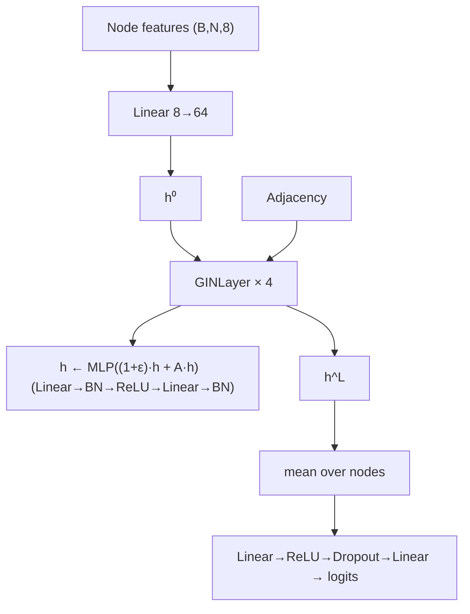
```mermaid
flowchart TD
    feats["Node features (B,N,8)"] --> inp["Linear 8→64"] --> h0["h⁰"]
    h0 --> gin["GINLayer × 4"]
    adj["Adjacency"] --> gin
    gin --> step["h ← MLP((1+ε)·h + A·h)  (Linear→BN→ReLU→Linear→BN)"]
    gin --> hL["h^L"]
    hL --> pool["mean over nodes"] --> head["Linear→ReLU→Dropout→Linear → logits"]
```

## 15. `tcn_forecaster` — TCN Forecaster

- Domain: Time-Series Forecasting
- Dataset: ETTm1
- Primary metric: MAE
- Metric direction: minimize
- Factory key: `tcn_forecaster`
- Model kwargs: none
- Training recipe:
  - `batch_size=128`
  - `max_epochs=80`
  - `learning_rate=1.0e-3`
  - `optimizer_name=adam`
  - `momentum=0.9`
  - `weight_decay=1.0e-4`
  - `lr_schedule=cosine`
  - `lr_min_factor=0.01`
  - `grad_clip_norm=1.0`
- Perforation registration: default
- PQAT epoch budget: `10`
- Architecture diagram:

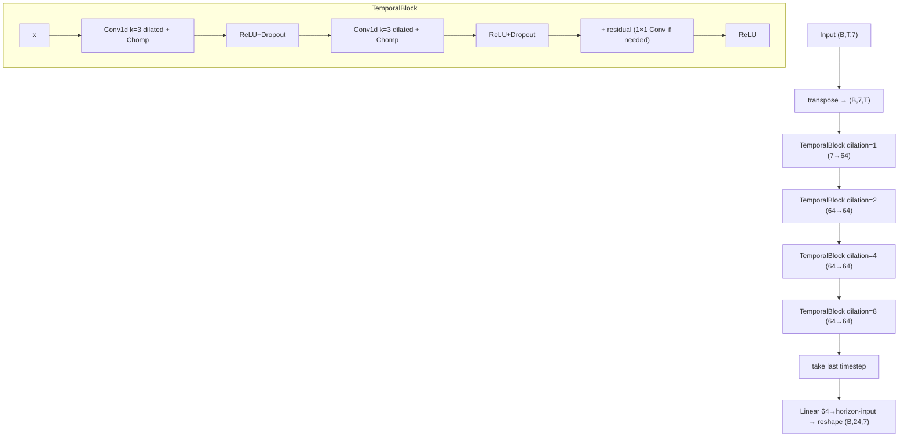
```mermaid
flowchart TD
    in["Input (B,T,7)"] --> tr["transpose → (B,7,T)"]
    tr --> tb1["TemporalBlock dilation=1 (7→64)"]
    tb1 --> tb2["TemporalBlock dilation=2 (64→64)"]
    tb2 --> tb3["TemporalBlock dilation=4 (64→64)"]
    tb3 --> tb4["TemporalBlock dilation=8 (64→64)"]
    tb4 --> last["take last timestep"] --> head["Linear 64→horizon·input → reshape (B,24,7)"]
    subgraph TB ["TemporalBlock"]
        x["x"] --> c1["Conv1d k=3 dilated + Chomp"] --> r1["ReLU+Dropout"]
        r1 --> c2["Conv1d k=3 dilated + Chomp"] --> r2["ReLU+Dropout"]
        r2 --> add["+ residual (1×1 Conv if needed)"] --> rl["ReLU"]
    end
```

## 16. `gru_forecaster` — GRU Forecaster

- Domain: Time-Series Forecasting
- Dataset: Weather
- Primary metric: MAE
- Metric direction: minimize
- Factory key: `gru_forecaster`
- Model kwargs: none
- Training recipe:
  - `batch_size=128`
  - `max_epochs=80`
  - `learning_rate=1.0e-3`
  - `optimizer_name=adam`
  - `momentum=0.9`
  - `weight_decay=0.0`
  - `lr_schedule=cosine`
  - `lr_min_factor=0.01`
  - `grad_clip_norm=1.0`
- Architecture: two-layer GRU forecaster implemented with explicit Linear update/reset/new gates so recurrent projections can be perforated.
- Perforation registration: default (`nn.Linear`, `nn.Conv1d`, `nn.Conv2d`). The recurrent `.cells` modules are registered as track-only (PAI wraps them for observation but does not insert dendrites into them); dendrite insertion is confined to the readout `Linear` in `.head` only. This avoids per-timestep perforation overhead on long sequences.
- PQAT epoch budget: `10`
- Architecture diagram:

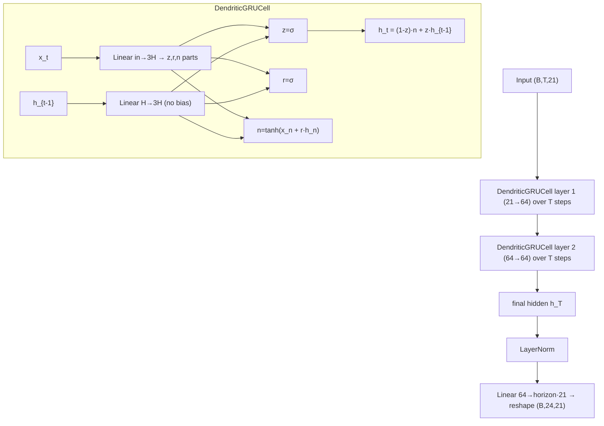
```mermaid
flowchart TD
    in["Input (B,T,21)"] --> c1["DendriticGRUCell layer 1 (21→64) over T steps"]
    c1 --> c2["DendriticGRUCell layer 2 (64→64) over T steps"]
    c2 --> last["final hidden h_T"] --> ln["LayerNorm"]
    ln --> head["Linear 64→horizon·21 → reshape (B,24,21)"]
    subgraph Cell ["DendriticGRUCell"]
        x["x_t"] --> ig["Linear in→3H → z,r,n parts"]
        h["h_{t-1}"] --> hg["Linear H→3H (no bias)"]
        ig --> z["z=σ"]
        ig --> r["r=σ"]
        ig --> n["n=tanh(x_n + r·h_n)"]
        hg --> z
        hg --> r
        hg --> n
        z --> out["h_t = (1-z)·n + z·h_{t-1}"]
    end
```

## 17. `pointnet_modelnet40` — PointNet

- Domain: 3D Point Cloud Classification
- Dataset: ModelNet40
- Primary metric: Accuracy
- Metric direction: maximize
- Factory key: `pointnet_modelnet40`
- Model kwargs: `num_classes=40`
- Architecture: PointNet with input transform, feature transform, shared 1x1 convolutions, global max pooling, and MLP classifier.
- Architecture diagram:

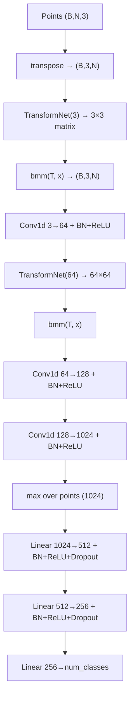
```mermaid
flowchart TD
    pts["Points (B,N,3)"] --> tp["transpose → (B,3,N)"]
    tp --> tnet1["TransformNet(3) → 3×3 matrix"] --> mm1["bmm(T, x) → (B,3,N)"]
    mm1 --> c1["Conv1d 3→64 + BN+ReLU"]
    c1 --> tnet2["TransformNet(64) → 64×64"] --> mm2["bmm(T, x)"]
    mm2 --> c2["Conv1d 64→128 + BN+ReLU"] --> c3["Conv1d 128→1024 + BN+ReLU"]
    c3 --> gp["max over points (1024)"]
    gp --> h1["Linear 1024→512 + BN+ReLU+Dropout"]
    h1 --> h2["Linear 512→256 + BN+ReLU+Dropout"]
    h2 --> head["Linear 256→num_classes"]
```
- Input pipeline: point clouds are sampled uniformly over the **mesh surface**,
  not read off the vertex list — triangles chosen with probability proportional
  to area, then a uniform barycentric point in each, matching what Qi et al.'s
  released `modelnet40_ply_hdf5_2048` clouds are. 2048 points are sampled once
  per mesh and cached to
  `data/modelnet40/surface_points_v1_{split}_2048.pt` (~300 MB, ~4 min to build,
  `MODELNET40_CACHE_VERSION` invalidates it); training draws a random 1024 of
  them each epoch, evaluation takes a fixed 1024-point prefix. Augmentation is
  a random rotation about **Z** (the raw OFF meshes are Z-up) plus clipped
  Gaussian jitter, training split only.
- Training recipe:
  - `batch_size=32`
  - `max_epochs=200`
  - `learning_rate=1.0e-3`
  - `optimizer_name=adam`
  - `momentum=0.9`
  - `weight_decay=1.0e-4`
  - `lr_schedule=step`
  - `lr_decay_every=20`
  - `lr_decay_gamma=0.7`
- Loss: cross-entropy + 0.001 × the feature-transform orthogonality penalty from
  Qi et al. §3.4, applied to the 64×64 transform only.
- Perforation registration: default
- PQAT epoch budget: `10`
- Cost: ~36 s/epoch. It was ~200 s before the clouds were cached, of which ~190 s
  was re-parsing OFF text — the dataloader, not the network, was this model's
  dominant cost.
- Read against Qi et al.'s 89.2%. The 100-epoch vertex-sampling run reached
  0.7937 validation accuracy; with surface samples the same 9th epoch scores
  0.7337 against 0.6128, so expect the full-budget number to land higher.
  Ignore `DYNAMIC_DENDRITIC_MIGRATION.md` §8's "13.4%, the base model is broken"
  — that predates the corrupted-eval fix and the orthogonality penalty.

## 18. `vae_mnist` — VAE

- Domain: Generative Modeling
- Dataset: MNIST
- Primary metric: ELBO
- Metric direction: maximize
- Factory key: `vae_mnist`
- Model kwargs: none
- Architecture: fully connected MNIST VAE with 32-dimensional latent bottleneck and ELBO training objective.
- Architecture diagram:

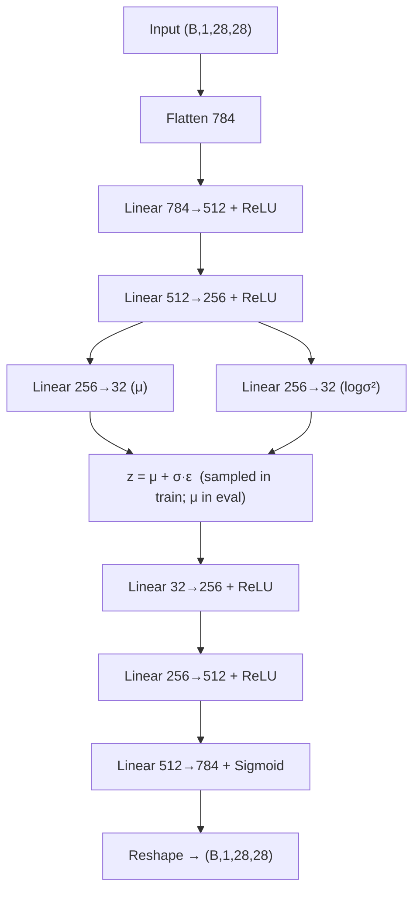
```mermaid
flowchart TD
    in["Input (B,1,28,28)"] --> fl["Flatten 784"] --> e1["Linear 784→512 + ReLU"] --> e2["Linear 512→256 + ReLU"]
    e2 --> mu["Linear 256→32 (μ)"]
    e2 --> lv["Linear 256→32 (logσ²)"]
    mu --> z["z = μ + σ·ε  (sampled in train; μ in eval)"]
    lv --> z
    z --> d1["Linear 32→256 + ReLU"] --> d2["Linear 256→512 + ReLU"] --> d3["Linear 512→784 + Sigmoid"] --> rec["Reshape → (B,1,28,28)"]
```
- Training recipe:
  - `batch_size=128`
  - `max_epochs=50`
  - `learning_rate=1.0e-3`
  - `optimizer_name=adam`
  - `momentum=0.9`
  - `weight_decay=0.0`
  - `lr_schedule=cosine`
  - `lr_min_factor=0.02`
- Perforation registration: default
- PQAT epoch budget: `10`

## 19. `snn_nmnist` — Spiking Neural Network

- Domain: Neuromorphic Computing
- Dataset: N-MNIST
- Primary metric: Accuracy
- Metric direction: maximize
- Factory key: `snn_nmnist`
- Model kwargs: `num_classes=10`
- Architecture: convolutional leaky-integrate-and-fire spiking network with 10 simulation steps and surrogate-gradient spike activation.
- Architecture diagram:

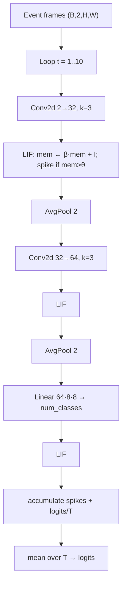
```mermaid
flowchart TD
    in["Event frames (B,2,H,W)"] --> loop["Loop t = 1..10"]
    loop --> c1["Conv2d 2→32, k=3"] --> lif1["LIF: mem ← β·mem + I; spike if mem>θ"]
    lif1 --> p1["AvgPool 2"] --> c2["Conv2d 32→64, k=3"] --> lif2["LIF"]
    lif2 --> p2["AvgPool 2"] --> fc["Linear 64·8·8 → num_classes"] --> lif3["LIF"]
    lif3 --> acc["accumulate spikes + logits/T"]
    acc --> avg["mean over T → logits"]
```
- Training recipe:
  - `batch_size=16`
  - `max_epochs=50`
  - `learning_rate=1.0e-3`
  - `optimizer_name=adam`
  - `momentum=0.9`
  - `weight_decay=1.0e-5`
  - `lr_schedule=cosine`
  - `lr_min_factor=0.01`
  - `grad_clip_norm=5.0`
- Perforation registration: default
- PQAT epoch budget: `10`

<!--
## 20. `unet_isic` — Tiny U-Net

- Domain: Medical Image Segmentation
- Dataset: ISIC 2018 Task 1
- Primary metric: Dice
- Metric direction: maximize
- Factory key: `unet_isic`
- Model kwargs: none
- Architecture: encoder-decoder U-Net with three downsampling blocks, bottleneck, transposed-convolution upsampling, skip connections, and binary mask head.
- Architecture diagram:

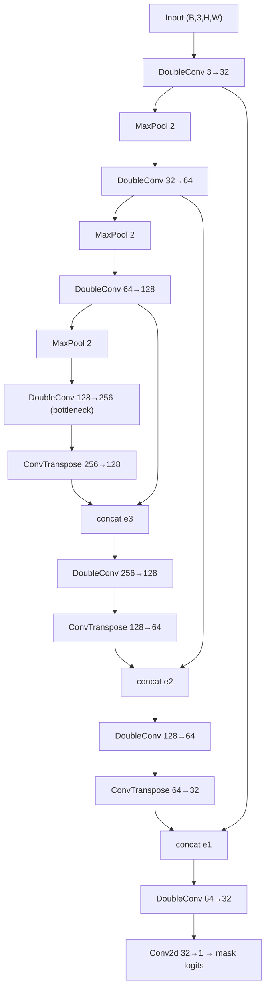
```mermaid
flowchart TD
    in["Input (B,3,H,W)"] --> e1["DoubleConv 3→32"] --> p1["MaxPool 2"]
    p1 --> e2["DoubleConv 32→64"] --> p2["MaxPool 2"]
    p2 --> e3["DoubleConv 64→128"] --> p3["MaxPool 2"]
    p3 --> mid["DoubleConv 128→256 (bottleneck)"]
    mid --> u3["ConvTranspose 256→128"] --> cat3["concat e3"] --> d3["DoubleConv 256→128"]
    e3 --> cat3
    d3 --> u2["ConvTranspose 128→64"] --> cat2["concat e2"] --> d2["DoubleConv 128→64"]
    e2 --> cat2
    d2 --> u1["ConvTranspose 64→32"] --> cat1["concat e1"] --> d1["DoubleConv 64→32"]
    e1 --> cat1
    d1 --> out["Conv2d 32→1 → mask logits"]
```
- Training recipe:
  - `batch_size=8`
  - `max_epochs=100`
  - `learning_rate=1.0e-3`
  - `optimizer_name=adam`
  - `momentum=0.9`
  - `weight_decay=1.0e-5`
- Perforation registration: default
- PQAT epoch budget: `10`
-->

## 21. `resnet18_cifar10` — ResNet-18

- Domain: Image Classification
- Dataset: CIFAR-10
- Primary metric: Accuracy
- Metric direction: maximize
- Factory key: `resnet18_cifar10`
- Model kwargs: none
- Training recipe:
  - `batch_size=128`
  - `max_epochs=200`
  - `learning_rate=1.0e-1`
  - `optimizer_name=sgd`
  - `momentum=0.9`
  - `weight_decay=5.0e-4`
  - `lr_schedule=cosine`
  - `warmup_epochs=5`
  - `label_smoothing=0.1`
  - `nesterov=True`
- Perforation registration: default
- PQAT epoch budget: `10`
- Architecture diagram:

```mermaid
flowchart TD
    in["Input (B,3,32,32)"] --> stem["Conv2d 3→64, k=3, s=1 (CIFAR stem; maxpool replaced by Identity)"]
    stem --> bn["BN+ReLU"] --> l1["Layer1: BasicBlock × 2 (64)"]
    l1 --> l2["Layer2: BasicBlock × 2 (128, stride 2)"]
    l2 --> l3["Layer3: BasicBlock × 2 (256, stride 2)"]
    l3 --> l4["Layer4: BasicBlock × 2 (512, stride 2)"]
    l4 --> gap["AdaptiveAvgPool"] --> fc["Linear 512→10"]
    note["BasicBlock = Conv→BN→ReLU→Conv→BN + skip"]
```

## 22. `mobilenetv2_cifar10` — MobileNetV2

- Domain: Image Classification
- Dataset: CIFAR-10
- Primary metric: Accuracy
- Metric direction: maximize
- Factory key: `mobilenetv2_cifar10`
- Model kwargs: none
- Training recipe:
  - `batch_size=128`
  - `max_epochs=200`
  - `learning_rate=1.0e-1`
  - `optimizer_name=sgd`
  - `momentum=0.9`
  - `weight_decay=4.0e-5`
  - `lr_schedule=cosine`
  - `warmup_epochs=5`
  - `label_smoothing=0.1`
  - `nesterov=True`
- Perforation registration: default
- PQAT epoch budget: `10`
- Architecture diagram:

```mermaid
flowchart TD
    in["Input (B,3,32,32)"] --> stem["Conv2d 3→32, k=3, s=1 (CIFAR stem)"]
    stem --> blocks["InvertedResidual blocks × 17 (expand → depthwise → project, with skip when shapes match)"]
    blocks --> conv["Conv2d → 1280 + BN+ReLU6"]
    conv --> gap["AdaptiveAvgPool"] --> dp["Dropout"] --> fc["Linear 1280→10"]
```

## 23. `saint_adult` — SAINT

- Domain: Tabular Classification
- Dataset: Adult Income
- Primary metric: Accuracy
- Metric direction: maximize
- Factory key: `saint_adult`
- Model kwargs: `num_classes=2`
- Training recipe:
  - `batch_size=256`
  - `max_epochs=200`
  - `learning_rate=1.0e-4`
  - `optimizer_name=adamw`
  - `momentum=0.9`
  - `weight_decay=1.0e-5`
  - `lr_schedule=cosine`
  - `lr_min_factor=0.02`
  - `warmup_epochs=5`
  - `grad_clip_norm=1.0`
- Architecture: SAINT-style tabular transformer with explicit Linear Q/K/V projections, column attention, row attention across the mini-batch, and pooled classification head.
- Architecture diagram:

```mermaid
flowchart TD
    in["Input (B,F=14)"] --> emb["Linear 1→64 per feature + column embedding → tokens (B,F,64)"]
    emb --> blocks["depth × 2"]
    blocks --> col["Column block: SelfAttention(Q,K,V Linear; out Linear) + LN + FFN(Linear→GELU→Linear) + LN  (over F tokens)"]
    col --> rowt["transpose batch↔feature → row-attention block (across batch) → transpose back"]
    rowt --> mix["tokens = ½ (column_out + row_out)"]
    mix --> mean["mean over feature tokens → (B,64)"]
    mean --> head["LN → Linear 64→64 → ReLU → Linear → num_classes"]
```
- Perforation registration: default
- PQAT epoch budget: `10`

## 24. `capsnet_mnist` — CapsNet

- Domain: Image Classification
- Dataset: MNIST
- Primary metric: Accuracy
- Metric direction: maximize
- Factory key: `capsnet_mnist`
- Model kwargs: `num_classes=10`
- Architecture: Capsule Network with convolutional stem, primary capsules, digit capsules, three routing iterations, and class logits from capsule lengths.
- Architecture diagram:

```mermaid
flowchart TD
    in["Input (B,1,28,28)"] --> conv["Conv2d 1→256, k=9 + ReLU"]
    conv --> prim["PrimaryCapsules: Conv2d → reshape → 1152 capsules of dim 8 + squash"]
    prim --> votes["Votes: einsum(primary, route_weights) → (B, 1152, num_classes, 16)"]
    votes --> route["Routing × 3: softmax(logits) → coeffs → outputs = squash(Σ c·v) → logits += v·outputs"]
    route --> out["Digit caps (B, num_classes, 16)"] --> norm["||·|| over capsule dim → class scores"]
```
- Training recipe:
  - `batch_size=128`
  - `max_epochs=30`
  - `learning_rate=1.0e-3`
  - `optimizer_name=adam`
  - `momentum=0.9`
  - `weight_decay=0.0`
  - `lr_schedule=step`
  - `lr_decay_every=1`
  - `lr_decay_gamma=0.96`
- Perforation registration: default (`nn.Linear`, `nn.Conv1d`, `nn.Conv2d`). The decoder reconstruction head linears (`.decoder.0` and `.decoder.2`) are registered as track-only; dendrite insertion applies to the convolutional stem, primary capsules, and routing weights only.
- PQAT epoch budget: `9`
